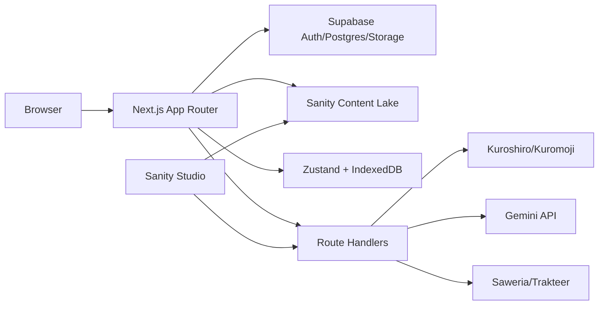
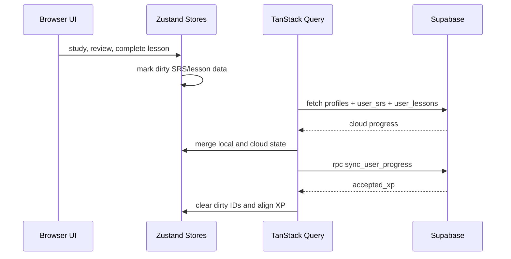

<p align="center">
  
</p>

<h1 align="center">NihongoRoute</h1>

<p align="center">
  A Japanese-learning platform for Indonesian learners, built with an offline-first study loop, SRS review, gamification, Sanity editorial content, and Supabase-backed progress sync.
</p>

<p align="center">
  
  
  
  
  
  
  
</p>

---

## Overview

NihongoRoute combines course lessons, vocab/kanji/grammar libraries, reading and listening material, flashcards, SRS review, mock exams, dashboard gamification, support/donation display, furigana generation, cached TTS playback, and an embedded Sanity Studio.

The application uses a split-source architecture:

| Layer | Responsibility |
| --- | --- |
| Next.js App Router | Pages, layouts, metadata routes, route handlers, embedded Studio route |
| Supabase | Auth, Postgres data, user progress, SRS, support records, TTS cache metadata/storage, sync RPC |
| Sanity | Editorial learning content: lessons, reading, listening, mock exams |
| Zustand | Offline-first browser state persisted to IndexedDB |
| TanStack Query | Session/progress fetching, cloud merge, background sync |
| Kuroshiro/Kuromoji | Furigana conversion in Node route handlers |

## Quick Links

| Document | Purpose |
| --- | --- |
| [ARCHITECTURE.md](ARCHITECTURE.md) | Full technical architecture and data-flow audit |
| [architecture_visual.md](architecture_visual.md) | Mermaid diagrams for runtime, data, sync, and APIs |
| [project_folder_structure.md](project_folder_structure.md) | Repository tree and folder responsibilities |
| [SECURITY.md](SECURITY.md) | Security policy, secret handling, and review checklist |
| [docs/enterprise-readiness.md](docs/enterprise-readiness.md) | Enterprise controls, remaining work, CI, deployment, rollback |
| [docs/operations-runbook.md](docs/operations-runbook.md) | Health checks, incidents, backup, and restore operations |
| [src/app/api/health/route.ts](src/app/api/health/route.ts) | Runtime health and env readiness endpoint |
| [sanity.config.ts](sanity.config.ts) | Embedded Sanity Studio configuration |

## Feature Surface

| Area | Routes / Modules |
| --- | --- |
| Landing | `/` |
| Auth | `/login`, `/forgot-password`, `/update-password`, `/auth/callback` |
| Dashboard | `/dashboard` |
| Courses | `/courses`, `/courses/[categoryId]`, `/courses/[categoryId]/[slug]` |
| Library | `/library`, vocab, kanji, grammar, reading, listening, cheatsheet |
| Exams | `/exams`, `/exams/[id]` |
| Review | `/review` |
| Tools | `/tools`, flashcards, kana, survival, writing, dictation |
| Account | `/settings`, `/onboarding` |
| Social/support | `/share`, `/social`, `/support` |
| Studio | `/studio/[[...tool]]` |

## Architecture Snapshot



Primary sync path:



## Getting Started

```bash
npm install
npm run dev
```

Open:

```text
http://localhost:3000
```

Production build:

```bash
npm run build
npm run start
```

## Scripts

| Command | Description |
| --- | --- |
| `npm run dev` | Start the Next.js dev server |
| `npm run build` | Build production output |
| `npm run start` | Start the production server |
| `npm run lint` | Run ESLint |
| `npm run lint:fix` | Run ESLint with fixes |
| `npm run typecheck` | Run strict TypeScript checks without emitting files |
| `npm run test` | Run Vitest once |
| `npm run test:unit` | Run the unit-test quality gate |
| `npm run test:watch` | Run Vitest in watch mode |
| `npm run test:e2e` | Run Playwright E2E tests |
| `npm run db:migrations:check` | Validate Supabase migration names and duplicate timestamps |
| `npm run prepare` | Install Husky hooks |

## Environment

Required by `/api/health`:

| Variable | Purpose |
| --- | --- |
| `NEXT_PUBLIC_SUPABASE_URL` | Public Supabase project URL |
| `NEXT_PUBLIC_SUPABASE_ANON_KEY` | Public Supabase anon key |
| `NEXT_PUBLIC_SANITY_PROJECT_ID` | Sanity project ID |
| `NEXT_PUBLIC_SANITY_DATASET` | Sanity dataset |
| `NEXT_PUBLIC_SITE_URL` | Canonical site URL for metadata, sitemap, CORS |

Feature/server variables:

| Variable | Purpose |
| --- | --- |
| `ADMIN_API_SECRET` | Protects admin bridge APIs used by Studio tooling |
| `SUPABASE_SERVICE_ROLE_KEY` | Server-only Supabase admin access |
| `GEMINI_API_KEY` | AI lesson/admin assistant generation |
| `SANITY_API_READ_TOKEN` | Draft/non-CDN Sanity reads |
| `SANITY_API_WRITE_TOKEN` | Sanity write/script access |
| `SAWERIA_WEBHOOK_SECRET` | Saweria webhook validation |
| `TRAKTEER_WEBHOOK_SECRET` | Trakteer webhook validation |
| `SANITY_STUDIO_ADMIN_API_SECRET` | Studio-side admin bridge secret |

Optional script/AI gateway variables:

| Variable | Purpose |
| --- | --- |
| `AI_BASE_URL` | OpenAI-compatible gateway base URL used by scripts |
| `AI_API_KEY` | Script AI gateway key |
| `AI_MODEL` | Script AI model override |

Security rule: never expose `SUPABASE_SERVICE_ROLE_KEY`, `ADMIN_API_SECRET`, webhook secrets, or Sanity write tokens through `NEXT_PUBLIC_*`.

## Data Model Notes

Supabase schema is consolidated in a single migration (`supabase/migrations/20260620130000_initial_schema.sql`):

| Domain | Tables |
| --- | --- |
| Public library | `course_categories`, `kanji`, `vocab`, `grammar`, `lessons`, `cheatsheets` |
| Auxiliary content | `expressions`, `radicals`, `sentences` |
| JLPT exam bank | `jlpt_exam_templates`, `jlpt_passages`, `jlpt_questions`, `jlpt_exam_template_questions` |
| User progress | `profiles`, `user_srs`, `user_lessons` |
| User exams | `user_exam_sessions`, `user_exam_answers` |
| Community | `community_posts`, `community_comments` |
| Feedback/support/cache | `user_feedback`, `supporters`, `tts_cache` |
| Storage buckets | `tts-cache`, `exam-assets` |

Sanity schemas:

| Schema | Content |
| --- | --- |
| `lesson` | Course lesson content, quizzes, related vocab/kanji/grammar |
| `readingMaterial` | Reading content, translation, media, quizzes |
| `listeningMaterial` | Transcript, timestamps, media, quizzes |
| `mockExam` | Timed exam metadata and question sets |

## Testing

```bash
npm run test
npm run test:e2e
```

Vitest covers hooks, stores, and core libraries under `__tests__`.

Playwright covers auth, dashboard, navigation, and study flows under `e2e`. The Playwright config starts `npm run dev` at `http://localhost:3000` and runs desktop plus mobile browser projects.

## Project Conventions

| Convention | Rule |
| --- | --- |
| Zustand selectors | Use atomic selectors such as `useUserStore((s) => s.xp)` |
| Store destructuring | Do not destructure `useUserStore`, `useSRSStore`, `useUIStore`, or `useAuthStore` results |
| Service role | Keep `createAdminClient()` usage server-only |
| Sanity changes | Update `sanity/schemaTypes`, `src/lib/queries.ts`, actions, and page clients together |
| Sync payloads | Keep `useCloudData`, `useCloudMutation`, `useSRSStore.mergeProgress`, and `sync_user_progress` aligned |
| TTS | Generate audio offline; `/api/tts` only serves cached audio and returns 404 on cache miss |

## Repository Map

```text
src/app         App Router pages, layouts, route handlers, metadata routes
src/actions     Server Actions for Supabase/Sanity reads
src/components  UI primitives, layout shell, providers, feature modules
src/hooks       Cloud sync, hydration, cached audio, mounted-state helpers
src/lib         Supabase/Sanity clients, SRS, gamification, TTS, utilities
src/store       Zustand offline-first stores
src/types       Shared database and library types
sanity          Studio components and schema types
supabase        SQL migrations
scripts         Content, TTS, Sanity, Supabase maintenance scripts
__tests__       Vitest tests
e2e             Playwright tests
public          Static images, logos, fonts, Open Graph assets
```

## Operational Notes

`/api/tts` serves pre-generated audio from Supabase `tts_cache` and storage bucket `tts-cache`. It does not synthesize audio in real time; cache misses intentionally fall back to browser Web Speech behavior on the client.

Scripts under `scripts/` are operational tools for content generation, Sanity/Supabase alignment, TTS cache work, grammar ordering, and data cleanup. Many require `.env.local`, service-role access, Sanity write tokens, Gemini or AI gateway credentials, and local audio-generation prerequisites.
