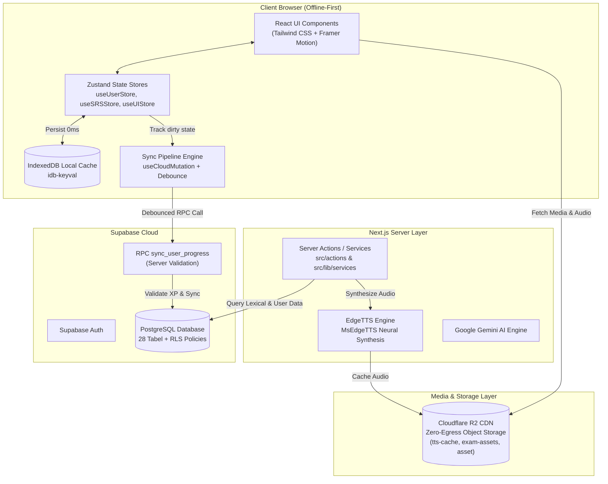

<p align="center">
  <a href="https://www.nihongoroute.my.id">
    
  </a>
</p>

<h1 align="center">🇯🇵 NihongoRoute</h1>

<p align="center">
  <strong>Platform Pembelajaran Bahasa Jepang Modern Berbasis <em>Offline-First</em> &amp; Zero-Egress Storage</strong>
</p>

<p align="center">
  
  
  
  
  
  
</p>

<p align="center">
  <a href="docs/README.md">📖 Dokumentasi Teknis</a> 
  • 
  <a href="#-memulai-cepat-quick-start">🚀 Panduan Instalasi</a> 
  • 
  <a href="#-arsitektur-sistem">🏛️ Arsitektur Sistem</a>
  • 
  <a href="CONTRIBUTING.md">🤝 Kontribusi</a>
  • 
  <a href="ROADMAP.md">🗺️ Roadmap</a>
</p>

---

## ⚡ Ikhtisar Proyek

**NihongoRoute** adalah *self-study platform* modern yang didesain khusus untuk pembelajaran Bahasa Jepang mandiri yang tangguh, cepat, dan instan tanpa bergantung pada koneksi internet yang stabil. 

Mengusung arsitektur **Offline-First 3-Tier Sync**, seluruh sesi belajar, kuis, dan review kartu *spaced repetition* (SRS) diproses secara lokal dengan latensi **0ms**, kemudian disinkronkan secara aman ke cloud Supabase secara *background*. Media dan audio disajikan secepat kilat melalui **Cloudflare R2 CDN** dengan **0 egress fees**.

---

## 🔥 Fitur Utama

| Fitur | Deskripsi |
|---|---|
| 🔋 **Offline-First Engine** | Sesi kuis & SRS kartu dapat diakses luring tanpa koneksi internet. Data tersimpan di browser via IndexedDB (`idb-keyval` & Zustand). |
| ⚡ **Cloudflare R2 CDN Storage** | Seluruh aset media audio TTS dan gambar ujian disajikan via Cloudflare R2 Custom Domain CDN untuk latensi ultra-cepat dan **bebas batasan egress**. |
| 🔄 **3-Tier Smart Progress Sync** | Engine sinkronisasi otomatis memantau status *dirty state*, melakukan *debouncing* 2000ms, dan menyiarkan pembaruan antar-tab via `BroadcastChannel`. |
| 🛡️ **Anti-Cheat Gamification** | Perhitungan XP, Level, dan Streak divalidasi ketat di server PostgreSQL via RPC `sync_user_progress` untuk mencegah kecurangan klien. |
| 🔊 **Smart Neural TTS Audio** | Pelafalan bahasa Jepang MsEdgeTTS neural voices dengan sistem *cache-first* otomatis di R2 & `CacheStorage` browser. |
| 📝 **JLPT CBT Mock Exam Simulator** | Simulasi ujian JLPT N5 hingga N1 yang realistis dengan penentuan skor otomatis & analisis hasil terperinci. |

---

## 🏛️ Arsitektur Sistem



---

## 🛠️ Tech Stack & Ekosistem

- **Frontend Core**: Next.js 16 (App Router), React 19, TypeScript 5, Zustand 5, React Query v5.
- **Styling & Motion**: Tailwind CSS v4, Framer Motion, Radix UI Primitives, Iconify.
- **Data & Storage**: Supabase (PostgreSQL 28 Tabel, RLS Policies), Cloudflare R2 (S3 API Storage), IndexedDB (`idb-keyval`).
- **Media & AI**: MsEdgeTTS (`msedge-tts`), Google Generative AI (Gemini 2.5/3.x), Kuroshiro & Kuromoji Parser.
- **Testing & Quality**: Vitest (357 Unit Tests), ESLint, TypeScript Strict Mode, Migration Integrity Checkers.

---

## 🚀 Memulai Cepat (Quick Start)

### 1. Prasyarat System
- Node.js versi **`>= 20.x`** (direkomendasikan Node.js 22.x LTS).
- npm atau pnpm.

### 2. Kloning & Instalasi Dependensi
```bash
git clone https://github.com/zan-118/nihongoroute.git
cd nihongoroute
npm install
```

### 3. Konfigurasi Environment Variables
Salin file template `.env.example` ke `.env.local`:
```bash
cp .env.example .env.local
```

Isi variabel utama di `.env.local`:
```env
NEXT_PUBLIC_SITE_URL=http://localhost:3000
NEXT_PUBLIC_SUPABASE_URL=https://<your-supabase-ref>.supabase.co
NEXT_PUBLIC_SUPABASE_ANON_KEY=<your-anon-key>
SUPABASE_SERVICE_ROLE_KEY=<your-service-role-key>

# Cloudflare R2 CDN Storage Configuration
NEXT_PUBLIC_R2_PUBLIC_URL=https://pub-56cdfeb1d4f44bb9aa5b26f7758b52f1.r2.dev
R2_ACCOUNT_ID=<your-cloudflare-account-id>
R2_ACCESS_KEY_ID=<your-r2-access-key>
R2_SECRET_ACCESS_KEY=<your-r2-secret-key>
R2_BUCKET_NAME=nihongoroute
```

### 4. Menjalankan Server Development
```bash
npm run dev
```
Buka [http://localhost:3000](http://localhost:3000) pada browser Anda.

---

## 📦 Migrasi Storage (Supabase ➔ Cloudflare R2)

Proyek ini menyediakan skrip CLI otomatis untuk mentransfer seluruh aset media (`tts-cache`, `exam-assets`, `asset`) dari Supabase Storage ke Cloudflare R2 secara rekursif:

```bash
# 1. Tes simulasi migrasi tanpa mengunggah (Dry Run)
node scripts/migrate-supabase-to-r2.mjs --dry-run

# 2. Jalankan migrasi massal otomatis
node scripts/migrate-supabase-to-r2.mjs
```

---

## 🧪 Validasi & Quality Gate

Proyek ini menerapkan *Quality Gate* ketat yang wajib lolos sebelum rilis produksi:

```bash
npm run typecheck             # Validasi tipe ketat TypeScript (0 error)
npm run lint                  # Pengecekan standar linter ESLint
npm run test:unit             # Eksekusi 357 unit tests via Vitest
npm run db:migrations:check   # Validasi stempel berkas migrasi database
npm run build                 # Kompilasi build rilis produksi Next.js
```

---

## 📂 Peta Dokumentasi Teknis (`docs/`)

Dokumentasi arsitektur, model data, dan standar keamanan tersimpan lengkap di folder [`docs/`](docs/README.md):

| Dokumen | Deskripsi |
|---|---|
| 📖 **[docs/README.md](docs/README.md)** | Indeks utama & navigasi dokumentasi teknis |
| 🗺️ **[docs/OVERVIEW.md](docs/OVERVIEW.md)** | Gambaran umum proyek, visi, & target pengguna |
| 🏛️ **[docs/ARCHITECTURE.md](docs/ARCHITECTURE.md)** | Arsitektur 3-Tier, alur data offline, & diagram komponen |
| 📦 **[docs/GETTING_STARTED.md](docs/GETTING_STARTED.md)** | Panduan penyiapan lingkungan lokal dari awal |
| ⚙️ **[docs/CONFIGURATION.md](docs/CONFIGURATION.md)** | Matriks variabel lingkungan (Public vs Server-Only) |
| 🔌 **[docs/API_REFERENCE.md](docs/API_REFERENCE.md)** | Spesifikasi Server Actions & API Route Handlers |
| 💾 **[docs/DATA_MODEL.md](docs/DATA_MODEL.md)** | Spesifikasi 28 tabel PostgreSQL, RLS, & Storage Buckets |
| 🚢 **[docs/DEPLOYMENT.md](docs/DEPLOYMENT.md)** | Runbook deployment Vercel, strategi cache, & health check |
| 🔒 **[docs/SECURITY.md](docs/SECURITY.md)** | Panduan keamanan secrets, RLS policies, & audit checklist |
| 🎨 **[docs/DESIGN_SYSTEM.md](docs/DESIGN_SYSTEM.md)** | Token warna, tipografi, radius, & anti-pattern UI |
| 🛠️ **[docs/TROUBLESHOOTING.md](docs/TROUBLESHOOTING.md)** | Riwayat masalah umum dan panduan penyelesaiannya |
| 🤝 **[docs/CONTRIBUTING.md](docs/CONTRIBUTING.md)** | Workflow Git, commit convention, & siklus migrasi SQL |
| 📜 **[docs/ADR.md](docs/ADR.md)** | Architecture Decision Records (ADR) keputusan teknis |

---

<p align="center">
  <sub>Dikelola oleh tim pengembang NihongoRoute • Rilis terakhir diperbarui pada 6 Agustus 2026.</sub>
</p>
