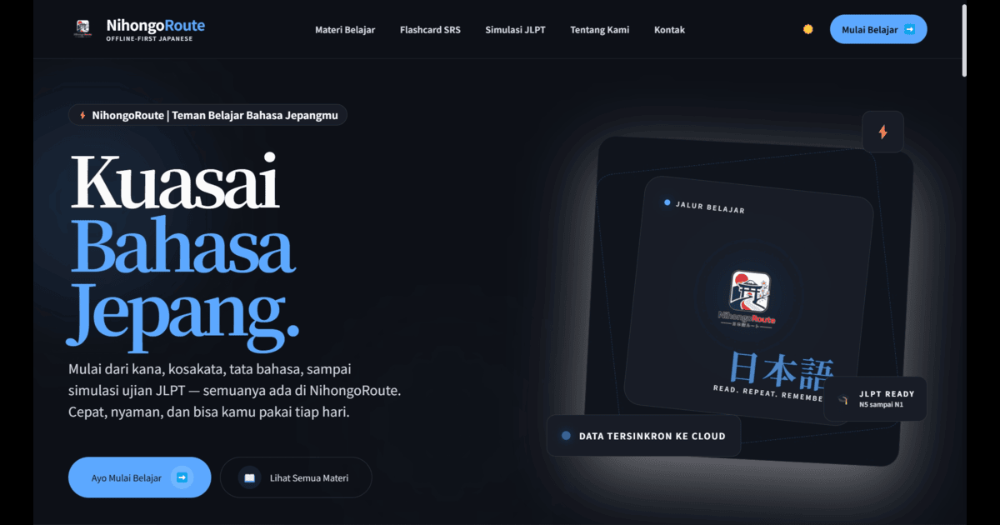

<p align="center">
  <a href="https://nihongoroute.my.id">
    
  </a>
</p>

<p align="center">
  
  
  
  
  
</p>

<p align="center">
  <strong>NihongoRoute</strong> adalah <em>self-study platform</em> modern untuk belajar Bahasa Jepang tanpa pusing soal koneksi internet. Mengusung arsitektur <strong>Offline-First</strong>, platform ini memastikan sesi belajar Anda tetap mulus, instan, dan bebas lemot—di mana saja, kapan saja.
</p>

<p align="center">
  <a href="file:///c:/nihongoroute/docs/README.md">📖 Baca Dokumentasi Teknis</a> 
  • 
  <a href="#-memulai-cepat-quick-start">🚀 Panduan Instalasi</a> 
  • 
  <a href="#-peta-dokumentasi">📂 Peta Dokumen</a>
</p>

---

## ⚡ Fitur Utama

### 🔋 Offline-First: Belajar Tanpa Putus
Nggak perlu takut progres belajar hilang saat internet mati. Semua data belajar, kuis, dan review kartu flashcard (SRS) langsung tersimpan aman di browser Anda menggunakan IndexedDB (via Zustand & `idb-keyval`). Rasakan UI super responsif dengan latensi 0ms.

### 🔄 Sync 3-Tingkat yang Pintar
Progres lokal Anda akan otomatis diunggah ke cloud Supabase secara cerdas. Menggunakan *dirty tracking* dan *debouncing* 2000ms untuk menghemat kuota internet, diselesaikan secara instan dengan resolusi konflik otomatis berbasis stempel waktu (*timestamp*).

### 🛡️ Anti-Cheat XP & Gamifikasi Adil
Persaingan sehat di papan peringkat! Perolehan XP, level, dan streak dihitung dan divalidasi langsung di server PostgreSQL lewat RPC `sync_user_progress`. Ditambah limit harian 150 XP bonus untuk mencegah bot dan skrip manipulasi dari sisi browser.

### 🔊 Smart Cache Text-to-Speech (TTS)
Pelafalan audio bahasa Jepang secepat kilat tanpa boros kuota. Rute API otomatis memutar file dari storage bucket `tts-cache` Supabase jika ada (*cache hit*), atau menyintesis suara secara instan menggunakan Edge Neural TTS saat *cache miss* tanpa membebani penyimpanan.

### 📝 Simulasi Ujian JLPT Realistis
Uji kemampuan Anda sebelum ujian JLPT yang sebenarnya (N5 hingga N1). Bank soal relasional (`jlpt_exam_templates`, `jlpt_passages`, `jlpt_questions`) dari database Supabase dialirkan secara dinamis ke mesin ujian melalui *adapter layer* `supabase-adapter.ts`.

---

## 🛠️ Di Balik Layar (Tech Stack)

NihongoRoute ditenagai oleh kombinasi Next.js App Router dan serverless database untuk performa tinggi:

* **Sisi Klien (Client-Side)**: Next.js 16 Client Components, Zustand (State), React Query v5 (Caching), Tailwind CSS (Styling), Framer Motion (Animations), Wanakana (IME).
* **Sisi Server (Server-Side)**: Next.js Server Actions, Route Handlers (Standalone Output), Kuroshiro & Kuromoji (Furigana), Google Gemini API (AI Assistant).
* **Infrastruktur**: Supabase (PostgreSQL Database, Auth, Storage Buckets, & RLS Policies).

---

## 🚀 Memulai Cepat (Quick Start)

### 1. Prasyarat
Pastikan runtime Node.js Anda berada pada versi **Node.js >= 20.x**.

### 2. Kloning & Instalasi
```bash
git clone https://github.com/username/nihongoroute.git
cd nihongoroute
npm install
```

### 3. Konfigurasi Kunci API (.env)
Salin berkas `.env.example` ke direktori proyek lokal Anda sebagai `.env.local`:
```bash
cp .env.example .env.local
```
Lengkapi nilai kunci Supabase, Sanity, Gemini API, dan token rahasia webhook Anda.

### 4. Jalankan Lingkungan Pengembangan
```bash
npm run dev
```
Buka browser di [http://localhost:3000](http://localhost:3000) untuk mengakses aplikasi.

### 5. Pengujian Kualitas Kode (Quality Gate Checks)
Jalankan seluruh perintah pengecekan standar kode dan pengujian otomatis sebelum mengirimkan Pull Request:
```bash
npm run typecheck             # Validasi tipe TypeScript
npm run lint                  # Pengecekan linter kode (ESLint)
npm run test:unit             # Eksekusi unit test fungsional (Vitest)
npm run db:migrations:check   # Validasi stempel berkas migrasi database
npm run build                 # Kompilasi build rilis produksi standalone
```

---

## 📂 Peta Dokumentasi

Dokumentasi detail arsitektur sistem dan model data tersimpan secara terstruktur pada direktori [`/docs`](file:///c:/nihongoroute/docs):

* 📖 **[Indeks Dokumentasi Teknis (docs/README.md)](file:///c:/nihongoroute/docs/README.md)**
* 🗺️ **[Overview & Deskripsi Proyek](file:///c:/nihongoroute/docs/overview.md)**
* 🏛️ **[Arsitektur Sistem & Alur Sinkronisasi](file:///c:/nihongoroute/docs/architecture.md)**
* 📦 **[Panduan Memulai & Setup](file:///c:/nihongoroute/docs/getting-started.md)**
* ⚙️ **[Konfigurasi Variabel Lingkungan](file:///c:/nihongoroute/docs/configuration.md)**
* 🔌 **[Referensi API & Endpoint Rute](file:///c:/nihongoroute/docs/api-reference.md)**
* 💾 **[Model Data & Skema Database (26 Tabel)](file:///c:/nihongoroute/docs/data-model.md)**
* 🚢 **[Deployment & Alur CI/CD](file:///c:/nihongoroute/docs/deployment.md)**
* 🔒 **[Keamanan, RLS, & Enkapsulasi Token](file:///c:/nihongoroute/docs/security.md)**
* 🛠️ **[Troubleshooting & FAQ Operasional](file:///c:/nihongoroute/docs/troubleshooting.md)**
* 🤝 **[Panduan Kontribusi & Git Workflow](file:///c:/nihongoroute/docs/contribution.md)**

---

<p align="center">
  <sub>Dikelola oleh tim pengembang NihongoRoute • Rilis terakhir diperbarui pada 17 Juli 2026.</sub>
</p>
