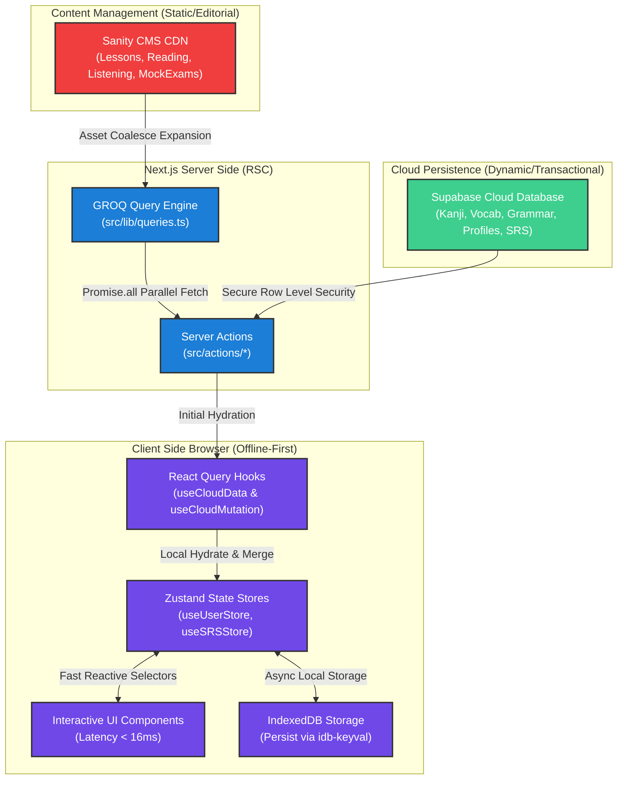
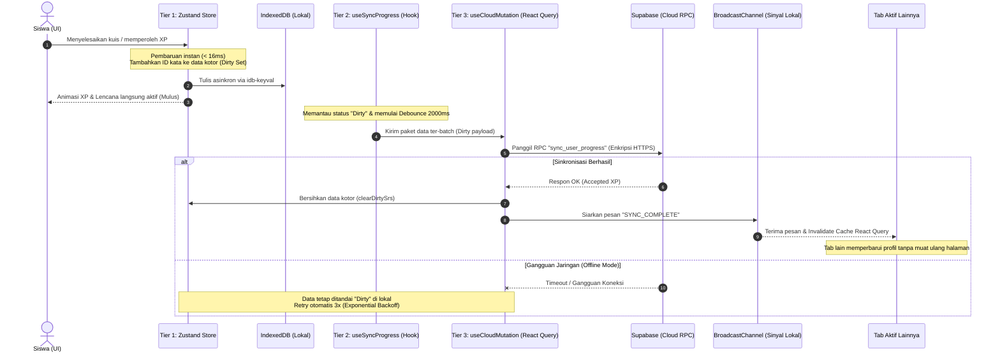
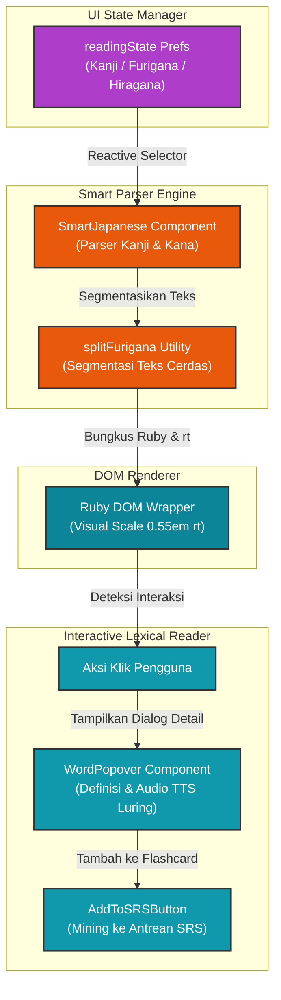
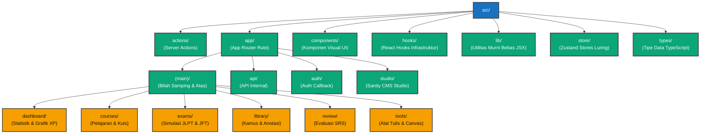

# 🌀 Peta Visual Arsitektur Sistem NihongoRoute
Representasi Aliran Data, Sinkronisasi 3-Tingkat, dan Pipeline Rendering Visual

Dokumen ini menyajikan pemetaan visual arsitektur NihongoRoute menggunakan diagram Mermaid untuk menggambarkan interaksi antar-lapisan, protokol sinkronisasi luring-pertama (*offline-first*), serta pipeline rendering visual interaktif.

---

## 💎 1. Arsitektur Umum & Alur Data Split-Source

NihongoRoute memisahkan dengan tegas konten editorial statis (dikelola via CMS) dari kemajuan belajar pengguna dan basis data kamus terstruktur (Supabase).

---

## 🔄 2. Protokol Sinkronisasi 3-Tingkat (3-Tier Sync) & Keamanan Multi-Tab

Untuk menjaga zero-latency pada antarmuka visual, mutasi data dilakukan pada keadaan lokal terlebih dahulu, lalu di-debounce asinkron untuk disinkronkan ke awan secara berkelompok.

---

## 🧠 3. Pipeline Rendering Furigana & Kamus Popover

Sistem visualisasi teks Jepang NihongoRoute berjalan secara interaktif berdasarkan setelan preferensi furigana global pembelajar.

---

## 📂 4. Arsitektur Modular Direktori Utama (`src/`)

Peta rute visual dan pembagian domain kode sumber yang diisolasi secara ketat demi kemudahan pengembangan tim (*separation of concerns*).

---

> [!NOTE]
> Pemetaan visual arsitektur ini disusun agar setiap rekayasawan baru dapat memahami siklus hidup hidrasi data luring-pertama, mekanisme sanitasi keamanan, serta integrasi pemrosesan furigana dalam waktu kurang dari 5 menit.
