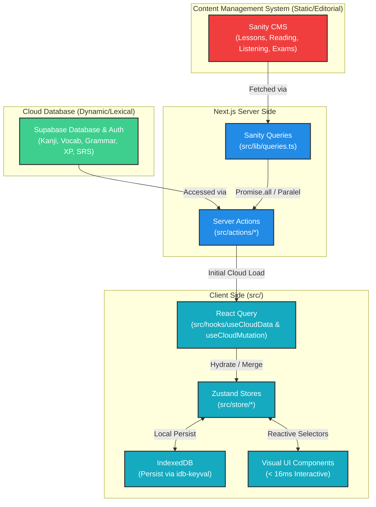
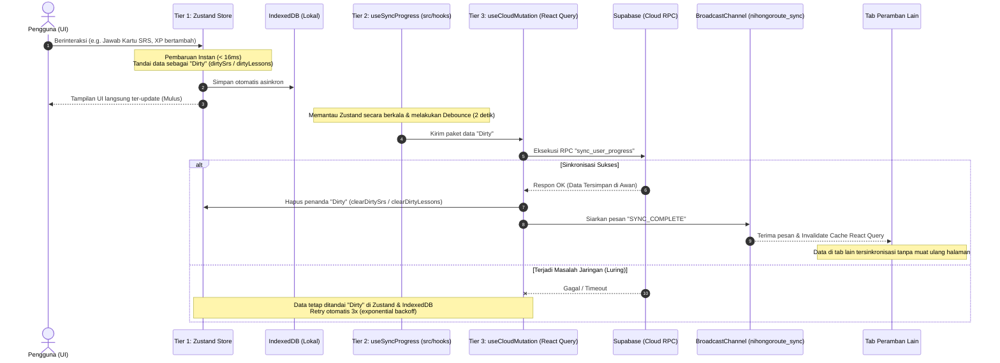
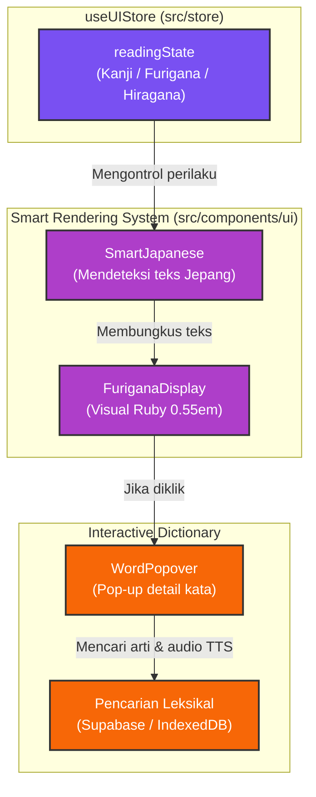
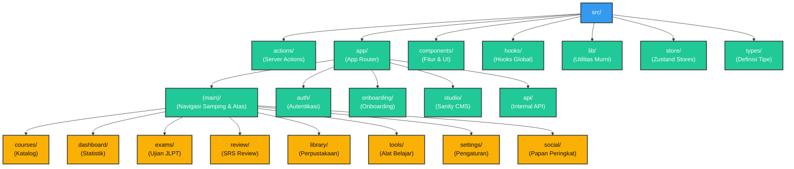

# 🌀 Visualisasi Arsitektur Proyek NihongoRoute

Dokumen ini menyajikan representasi visual dari arsitektur proyek NihongoRoute yang memprioritaskan fitur luring (*offline-first*), performa tinggi (< 16ms untuk interaksi lokal), dan sinkronisasi awan yang aman. Seluruh kode sumber berada di dalam direktori `src/`.

---

## 1. Arsitektur Umum & Alur Data Split-Source

NihongoRoute menggunakan pendekatan **Split-Source** untuk memisahkan data editorial statis dengan data dinamis dan data leksikal terstruktur pengguna.

---

## 2. Protokol Sinkronisasi 3-Tingkat (3-Tier Sync) & Keamanan Multi-Tab

Untuk menjamin performa *zero-latency* dan keandalan data luring, NihongoRoute menerapkan protokol 3-tingkat dengan sinkronisasi latar belakang yang ter-debound secara otomatis.

---

## 3. Jalur Rendering & Interaksi Furigana

Sistem rendering teks bahasa Jepang dikelola secara cerdas dan interaktif berdasarkan pengaturan global di `useUIStore`.

---

## 4. Arsitektur Direktori & Struktur Peta Rute (`src/app/`)

Struktur folder NihongoRoute yang diatur secara modular di dalam `src/` untuk memudahkan pemeliharaan dan skalabilitas.

---

> [!NOTE]
> Arsitektur ini dirancang untuk memastikan kenyamanan belajar maksimal bagi pengguna Indonesia tanpa adanya hambatan teknis (seperti paywall tersembunyi atau latensi jaringan yang mengganggu) dengan prinsip **Free Access Strategy** dan **Offline-First**.
