# NihongoRoute Architecture Visuals

Audit snapshot: 2026-06-09

The diagrams below mirror the current codebase. They use Mermaid so they can be rendered by GitHub, many Markdown viewers, and documentation tools.

## System Context

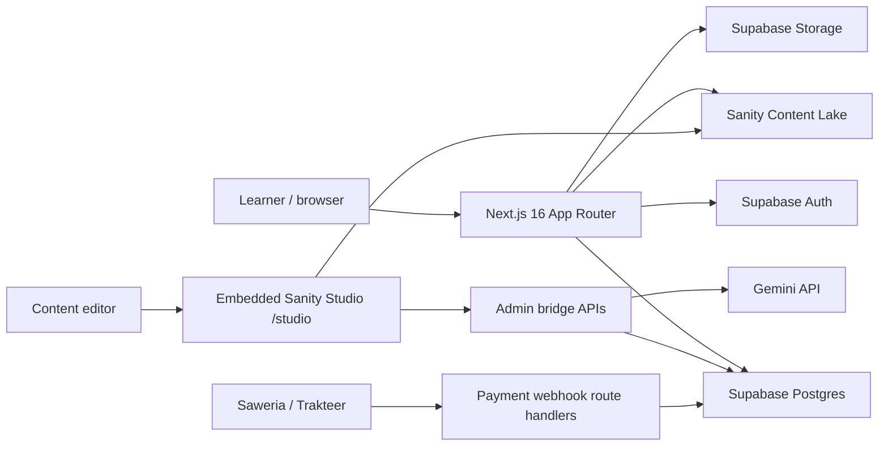

## Runtime Layers

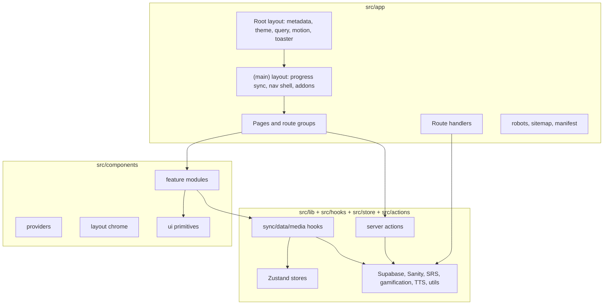

## Data Source Split

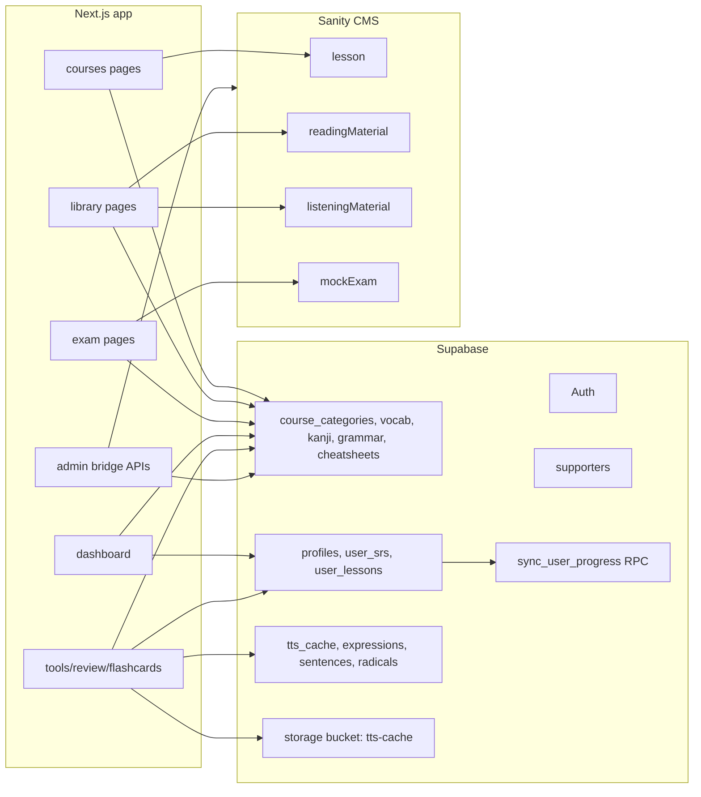

Note: `tts_cache`, `expressions`, `sentences`, `radicals`, and the `tts-cache` bucket exist in the live database and are captured by `supabase/migrations/20260609080000_sync_live_schema_drift.sql`.

## Request Flow for Normal Pages

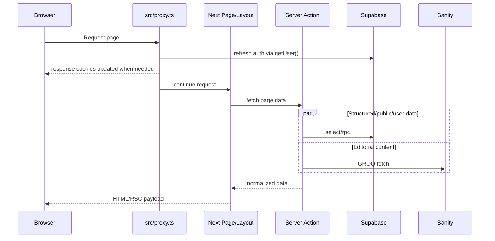

## Auth and Progress Sync

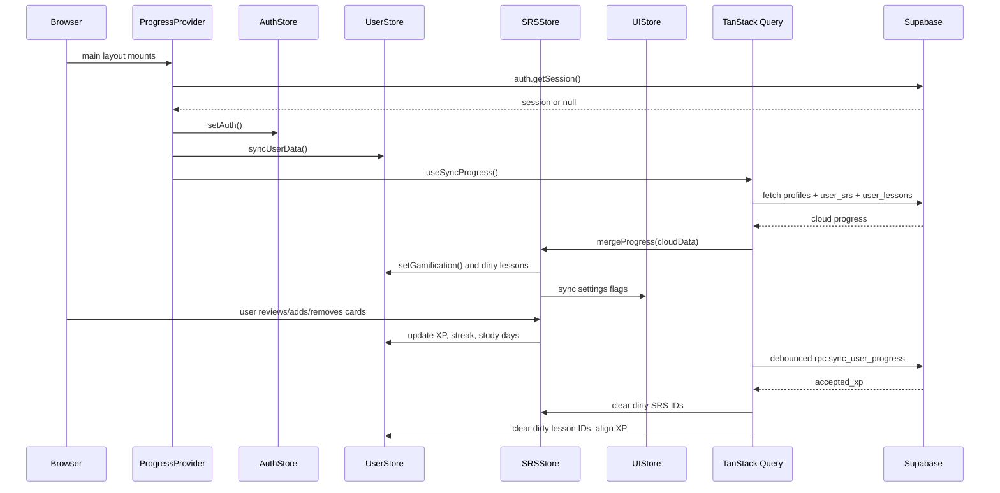

## Zustand Store Responsibilities

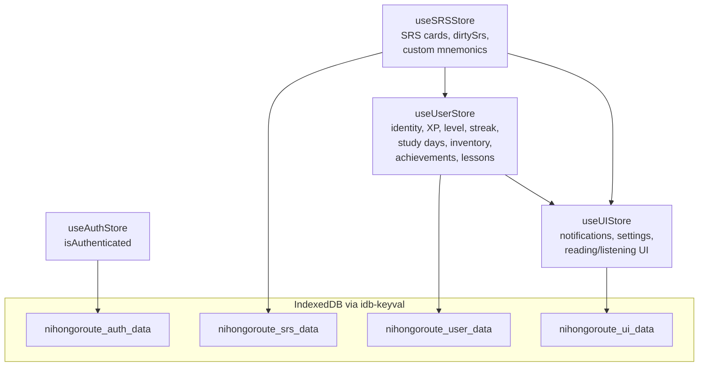

## Supabase Sync RPC Shape

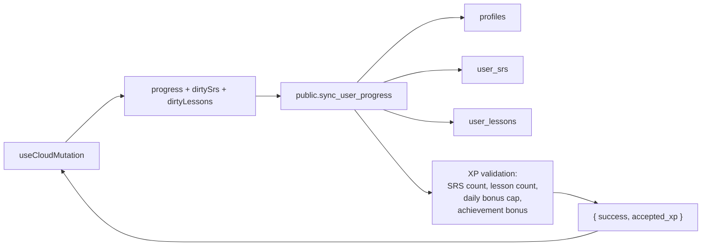

## API Route Handlers

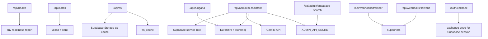

## Quality And Operations Gate

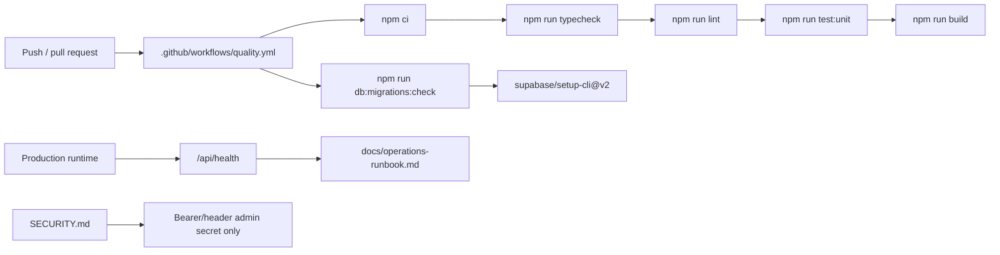

## Sanity Studio Bridge

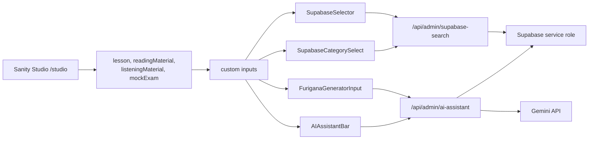

## Content Delivery by Feature

```mermaid
flowchart TB
  Dashboard["Dashboard"] --> Expressions["expressions"]
  Dashboard --> UserProgress["profiles/user_srs/user_lessons"]
  Courses["Courses"] --> Categories["course_categories"]
  Courses --> Lessons["Sanity lesson"]
  LibraryVocab["Library vocab"] --> Vocab["vocab"]
  LibraryKanji["Library kanji"] --> Kanji["kanji"]
  LibraryGrammar["Library grammar"] --> Grammar["grammar"]
  LibraryReading["Library reading"] --> Reading["Sanity readingMaterial"]
  LibraryListening["Library listening"] --> Listening["Sanity listeningMaterial"]
  Exams["Exams"] --> MockExam["Sanity mockExam"]
  Review["Review/SRS"] --> UserSRS["user_srs + local SRS store"]
  Support["Support"] --> Supporters["supporters"]
```

## Test Coverage Map

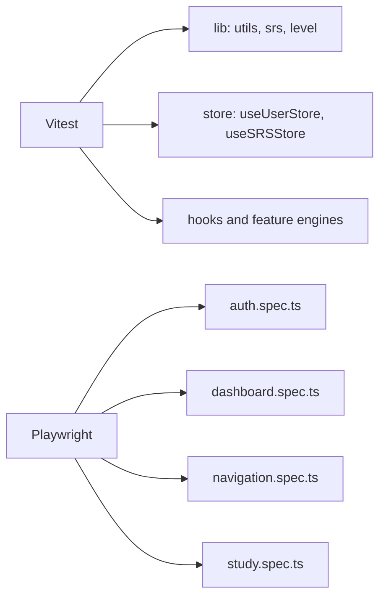

## Deployment Shape

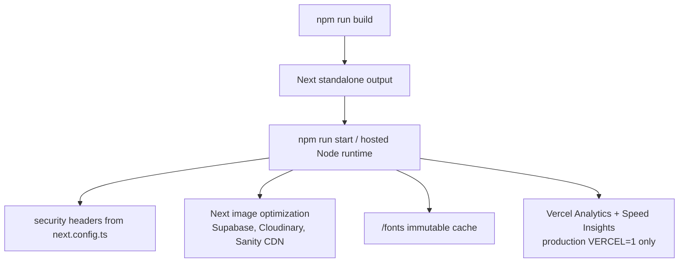
