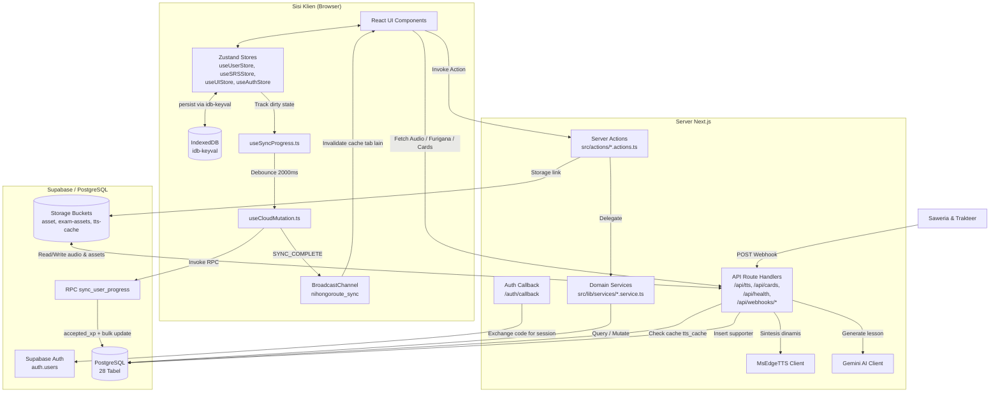

# Arsitektur Sistem NihongoRoute

> **Status Dokumentasi**: Aktif & Tersinkronisasi  
> **Terakhir Diperbarui**: 13 Agustus 2026 — Diverifikasi 100% dari `src/features/` & `src/lib/`  
> **Ruang Lingkup**: Diagram Komponen, Alur Data 3-Tier, State Management, ISR Caching, 22 Modul Feature Domains, & Struktur Modul Inti  
> **Rujukan Utama**: [README.md](../README.md) | [DATA_MODEL.md](DATA_MODEL.md) | [API_REFERENCE.md](API_REFERENCE.md) | [SECURITY.md](SECURITY.md)

---

## 📋 Daftar Isi

1. [Diagram Komponen Sistem](#1-diagram-komponen-sistem)
2. [Alur Data Utama](#2-alur-data-utama)
   - [A. Sinkronisasi Progres 3-Tier (Offline-First)](#a-sinkronisasi-progres-3-tier-offline-first)
   - [B. Alur Text-to-Speech (TTS)](#b-alur-text-to-speech-tts)
3. [Zustand Stores & Persistensi](#3-zustand-stores--persistensi)
4. [Strategi Rendering & Cache (ISR vs Client State)](#4-strategi-rendering--cache-isr-vs-client-state)
5. [Keputusan Desain Arsitektural](#5-keputusan-desain-arsitektural)
6. [Struktur 22 Modul Feature Domain (`src/features/`)](#6-struktur-22-modul-feature-domain-srcfeatures)
7. [Aturan Layer Kode & Encapsulation](#7-aturan-layer-kode--encapsulation)

---

## 1. Diagram Komponen Sistem



---

## 2. Alur Data Utama

### A. Sinkronisasi Progres 3-Tier (Offline-First)

```text
┌─────────────────────────────────────────────────────────────────┐
│ TIER 1 — Local Memory (Zero-Latency UI)                        │
│                                                                 │
│  Aktivitas belajar → Zustand store → IndexedDB (idb-keyval)    │
│  Perubahan data → dirtyLessons / dirtySrs (Set)                │
└───────────────────────────┬─────────────────────────────────────┘
                            │ perubahan terdeteksi
                            ▼
┌─────────────────────────────────────────────────────────────────┐
│ TIER 2 — Progress Sync Engine (src/lib/core/sync-pipeline-engine)│
│                                                                 │
│  ProgressSyncEngine mengonsolidasi:                             │
│  - Memantau dirtySrsSize, dirtyLessonsSize                      │
│  - Timer debounce 2000ms — reset jika ada mutasi baru           │
│  - Multi-tab event broadcasting via BroadcastChannel            │
│  - Anti-cheat XP reconciliation (accepted_xp)                   │
└───────────────────────────┬─────────────────────────────────────┘
                            │ timer selesai
                            ▼
┌─────────────────────────────────────────────────────────────────┐
│ TIER 3 — Cloud Mutation (useCloudMutation.ts + RPC)             │
│                                                                 │
│  1. buildSrsUpdates() + buildLessonUpdates()                    │
│  2. supabase.rpc('sync_user_progress', { ... })                 │
│  3. Server menghitung accepted_xp (anti-cheat)                  │
│  4. Engine merekonsiliasi XP lokal dari accepted_xp             │
│  5. BroadcastChannel.postMessage("SYNC_COMPLETE")               │
│  6. Tab lain invalidate query cache                             │
│                                                                 │
│  Retry: 3x dengan exponential backoff (maks 10 detik)           │
└─────────────────────────────────────────────────────────────────┘
```

### B. Alur Text-to-Speech (TTS)

```text
[Komponen UI (DialogueSection / ListeningWorkspace / TTSReader)]
      │
      ├─► Memanggil shared hook useLineTTS (src/features/media/hooks/useLineTTS.ts)
      │
      ├─► GET /api/tts?text=...&voice=...&rate=...
      │
      ▼
[/api/tts Route Handler]
      │
      ├─► Delegate ke processTtsPipeline (src/lib/audio/tts-pipeline.ts)
      │
      ├─► Hash MD5(text + voice + rate)
      │
      ├─► Query tabel tts_cache by hash
      │
      ├───[CACHE HIT]──► Return URL Cloudflare R2 Custom Domain CDN (NEXT_PUBLIC_R2_PUBLIC_URL)
      │                   Response 302 Redirect / Direct CDN URL (Zero Egress Supabase)
      │
      └───[CACHE MISS]─► Sintesis dinamis via MsEdgeTTS
                          Response: audio/mpeg + Cache-Control: no-store
                          (TIDAK otomatis disimpan ke DB)

[Fallback klien]
      │
      └─► Jika /api/tts gagal (error/timeout) →
          Web Speech API (window.speechSynthesis, lang: ja-JP)
```

---

## 3. Zustand Stores & Persistensi

Empat stores yang dipersistensi via `idb-keyval`:

| Store | File | Data Utama |
|---|---|---|
| `useAuthStore` | `src/store/useAuthStore.ts` | Session, user auth state |
| `useUserStore` | `src/store/useUserStore.ts` | XP, level, streak, studyDays, inventory, completedLessons, dirtyLessons |
| `useSRSStore` | `src/store/useSRSStore.ts` | SRS card states, dirtySrs |
| `useUIStore` | `src/store/useUIStore.ts` | Settings, notifications, sync status, UI preferences |

---

## 4. Strategi Rendering & Cache (ISR vs Client State)

### ISR (Incremental Static Regeneration)

Halaman konten library menggunakan ISR dengan `generateStaticParams()` untuk pre-render dan `revalidate = 604800` (7 hari):

| Halaman | Path |
|---|---|
| Kosakata detail | `/library/vocab/[slug]` |
| Kanji detail | `/library/kanji/[slug]` |
| Tata bahasa detail | `/library/grammar/[slug]` |
| Mendengar detail | `/library/listening/[slug]` |
| Membaca detail | `/library/reading/[slug]` |
| Cheatsheet detail | `/library/cheatsheet/[id]` |
| Pelajaran kursus | `/courses/[categoryId]/[slug]` |

---

## 5. Keputusan Desain Arsitektural

- **Zero-latency UI**: Zustand memproses state di klien sebelum data dikirim ke server.
- **Separasi konten library vs progres pengguna**: Konten library menggunakan ISR + revalidate. Progres pengguna menggunakan client-side sync via RPC.
- **Legacy exam adapter**: Komponen `MockExamEngine` membaca format data lama. Adapter `src/lib/exams/supabase-adapter.ts` (`toLegacyExamData`) memetakan data relasional baru ke format lama.
- **Optimasi bundle**: `optimizePackageImports` di `next.config.ts` untuk Radix UI, Iconify, Framer Motion, Date-fns, Sonner, Wanakana.
- **Mode baca global (single source of truth)**: `useUIStore.readingState.mode` adalah satu-satunya sumber mode tampilan (kanji/furigana/hiragana). `SmartJapanese` tidak men-default `mode` agar `JapaneseText` jatuh ke mode global; `ReadingContext` juga mengikat `mode` ke store. Toggle Topbar & control bar reading menulis balik ke store → preferensi konsisten lintas halaman & ter-persist (IndexedDB).
- **Custom Markdown Renderer**: Proyek menggunakan `LessonBlockRegistry` untuk menginjeksi komponen interaktif, dengan ekstensi Regex di `lesson-hydration-engine.ts` yang mendukung elemen struktural standar (Headings, Tables) serta ekstensi modern (Fenced Code Blocks & Horizontal Rules).

### 5a. Data Fetching via Server Actions (Bukan Query Client)

Seluruh kueri data konten **wajib** melalui Server Actions di `src/actions/*.actions.ts` — komponen client tidak boleh query Supabase langsung:

- `lookupDictionaryWordAction` (di `dictionary.actions.ts`) menggantikan query langsung di `DictionaryPopup` & `WordPopover`.
- Pola ini menjaga RLS, satu titik validasi, dan perilaku identik antar komponen.

### 5b. Struktur Modul Inti (`src/lib/`) & Pemecahan God Files

Beberapa modul domain besar dipecah menjadi folder kohesif dengan barrel re-export agar API publik tetap identik:

| Modul | Struktur Baru | Konsumen Tetap Tidak Berubah |
|---|---|---|
| `lib/learning/learning-ecosystem.ts` | `lib/learning/ecosystem/` → `types.ts`, `urls.ts`, `recommendations.ts`, `weak-points.ts`, `daily-route.ts` + barrel | ✅ Ya |
| `features/social/LeaderboardClient.tsx` | `hooks/useLeaderboard.ts` (logika data) + komponen UI murni | ✅ Ya |
| `features/exams/.../ExamResult.tsx` | `examResultData.ts` (logika skor) + `OfficialCertificateView.tsx` + `ModernBreakdownView.tsx` | ✅ Ya |
| `features/library/listening/.../ListeningWorkspace.tsx` | `workspace/` → `WorkspaceTabs.tsx`, `StudyPanel.tsx`, `DictationPanel.tsx`, `QuizPanel.tsx`, `MediaControlBar.tsx` | ✅ Ya |
| `features/library/reading/ReadingPageClient.tsx` | orkestrator tipis + `components/` → `ReadingPageHeader.tsx`, `ReadingVisuals.tsx`, `ReadingControlBar.tsx`, `VocabularyDrawer.tsx`, `ReadingQuizSection.tsx` + `utils/reading-metrics.ts` (helper murni) | ✅ Ya |
| `features/exams/.../ExamReview.tsx` | orkestrator + komponen review terpisah (`examResultData.ts` logika skor murni + komponen breakdown/certificate) | ✅ Ya |

> [!NOTE]
> **Prinsip pemecahan**: (1) ekstrak logika murni ke modul `.ts` yang bisa di-unit-test; (2) ekstrak view raksasa ke komponen terpisah; (3) pertahankan API publik identik lewat barrel agar konsumen tanpa perubahan; (4) untuk komponen dengan state yang harus bertahan antar tab, panel tetap di-*mount* dan disembunyikan via CSS (`hidden`) — bukan unmount bersyarat.

---

## 6. Struktur 22 Modul Feature Domain (`src/features/`)

Seluruh UI dan logika bisnis yang spesifik fitur dikelompokkan ke dalam 22 direktori domain di `src/features/`:

| No | Modul Feature | Peran Utama |
|:---:|---|---|
| 01 | `auth` | Form autentikasi, modal login, OAuth UI |
| 02 | `courses` | Tampilan navigasi hirarki & kurikulum kursus |
| 03 | `dashboard` | Dasbor utama pengguna, statistik belajar, ringkasan SRS |
| 04 | `ecosystem` | Peta ekosistem pembelajaran & rekomendasi |
| 05 | `exams` | Mesin simulasi CBT JLPT N5–N1, timer, & scoring |
| 06 | `games` | Minigame edukatif pembelajaran Jepang |
| 07 | `gamification` | Visualisasi XP, level badges, & streak celebration |
| 08 | `landing` | Halaman landing publik & penjelas produk |
| 09 | `library` | Komponen tampilan pustaka leksikal & wacana |
| 10 | `media` | Audio player, TTS hooks (`useLineTTS`), & media controls |
| 11 | `notifications` | Notification popover & activity feed |
| 12 | `pdf` | Rendering & ekspor sertifikat/materi PDF |
| 13 | `review` | Mode review flashcards, SRS master, & writing practice |
| 14 | `settings` | Pengaturan akun, preferensi UI, & sinkronisasi data |
| 15 | `share` | Fitur berbagi progres & pencapaian belajar |
| 16 | `social` | Community feed, postingan, komentar, & leaderboard |
| 17 | `srs` | Tombol tambah SRS & editor mnemonic |
| 18 | `support` | Widget feedback pengguna & halaman bantuan |
| 19 | `tools` | 14 sub-tools (shadowing-recorder, dictation, text-analyzer, conjugation-trainer, counter-trainer, jlpt-mini-drill, kana, kanji-similarity, particle-trainer, sentence-builder, stroke-canvas, weak-points, dictionary, search) |
| 20 | `user` | Navigasi user, profile editor, & auth hooks |
| 21 | `about` | Halaman publik Tentang Kami |
| 22 | `contact` | Halaman publik Kontak & form pesan (via `contact.actions.ts`) |

---

## 7. Aturan Layer Kode & Encapsulation

- **Pure Route Wrappers (`src/app/`)**: Folder rute `src/app/` HANYA diperuntukkan bagi file routing bawaan Next.js (`page.tsx`, `layout.tsx`, `route.ts`).
- **Co-located Feature UI (`src/features/<feature-name>/`)**: UI spesifik fitur wajib disimpan di folder fiturnya masing-masing.
- **Atomic UI Primitives (`src/components/ui/`)**: Direservasi hanya untuk UI primitives generik tanpa domain.
- **Server Actions (`src/actions/*.actions.ts`)**: Layer tipis validasi input yang mendelegasikan ke `src/lib/services/`.
- **Domain Services & Repository (`src/lib/services/`)**: Satu-satunya layer yang melakukan query Supabase database.
