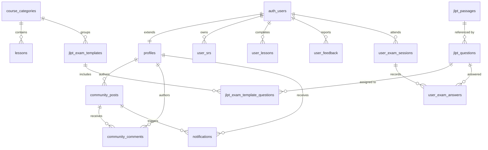

# Model Data & Database Supabase

> **Status Dokumentasi**: Aktif & Tersinkronisasi  
> **Terakhir Diperbarui**: 13 Agustus 2026  
> **Ruang Lingkup**: 28 Tabel PostgreSQL, ERD Diagram, RPC Functions, Triggers, & Storage Buckets  
> **Catatan Snapshot**: Jumlah baris (*row count*) pada tabel dinamis pengguna (`profiles`, `user_srs`, `user_lessons`, `community_posts`) merupakan snapshot data produksi per 2 Agustus 2026 dan bertambah sesuai aktivitas pengguna. Skema kolom, tipe data, dan RLS bersifat statis terverifikasi.  
> **Rujukan Utama**: [README.md](../README.md) | [ARCHITECTURE.md](ARCHITECTURE.md) | [SECURITY.md](SECURITY.md)

---

## 📋 Daftar Isi

1. [Spesifikasi 28 Tabel PostgreSQL](#1-spesifikasi-28-tabel-postgresql)
   - [A. Pengguna & Progres (Data Dinamis)](#a-pengguna--progres-data-dinamis)
   - [B. Pustaka Konten (Dataset Referensi)](#b-pustaka-konten-dataset-referensi)
   - [C. Simulasi Ujian JLPT](#c-simulasi-ujian-jlpt)
   - [D. Komunitas & Utilitas](#d-komunitas--utilitas)
2. [Diagram ERD (Entity Relationship Diagram)](#2-diagram-erd-entity-relationship-diagram)
3. [Database Functions & Triggers](#3-database-functions--triggers)
4. [Storage Buckets](#4-storage-buckets)
5. [Anti-Cheat & Formula Validasi XP](#5-anti-cheat--formula-validasi-xp)

---

## 1. Spesifikasi 28 Tabel PostgreSQL

### A. Pengguna & Progres (Data Dinamis)

#### 1. `profiles` (Snapshot Baseline: 91 rows)
Profil pengguna, gamifikasi, dan preferensi.

| Kolom | Tipe | Null | Default | Keterangan |
|---|---|---|---|---|
| `id` | uuid, PK | NO | — | FK → `auth.users(id)` ON DELETE CASCADE |
| `full_name` | text | YES | — | Nama lengkap pengguna |
| `avatar_url` | text | YES | — | URL avatar profil |
| `xp` | integer | NO | `0` | Poin pengalaman terverifikasi |
| `level` | integer | NO | `1` | Level akun pengguna |
| `streak` | integer | NO | `0` | Beruntun hari belajar aktif |
| `today_review_count` | integer | NO | `0` | Review selesai hari ini |
| `last_study_date` | text | YES | — | Format `YYYY-MM-DD` |
| `study_days` | jsonb | NO | `'{}'` | Peta tanggal → jumlah review |
| `inventory` | jsonb | NO | `'{"streakFreeze": 0}'` | Item virtual + achievements |
| `settings` | jsonb | NO | `'{"notificationsEnabled": false}'` | Preferensi aplikasi |
| `created_at` / `updated_at` | timestamptz | NO | `now()` | Timestamp audit |

**Triggers**: `profiles_updated_at`, `set_profiles_updated_at` → `handle_updated_at()`, `tr_validate_profile_integrity` → `validate_profile_integrity()`.

#### 2. `user_srs` (Snapshot Baseline: 1.497 rows)
Status SRS (Spaced Repetition) per kartu per pengguna.

| Kolom | Tipe | Null | Default |
|---|---|---|---|
| `id` | uuid, PK | NO | `gen_random_uuid()` |
| `user_id` | uuid | NO | FK → `auth.users(id)` ON DELETE CASCADE |
| `word_id` | text | NO | Identifier item vocab/kanji |
| `interval` | integer | NO | `1` |
| `repetition` | integer | NO | `0` |
| `ease_factor` | real | NO | `2.5` |
| `next_review` | timestamptz | YES | Jadwal review berikutnya |
| `status` | text | NO | `'learning'` |
| `custom_mnemonic` | text | YES | Catatan mnemonic pribadi |

**Constraint**: `UNIQUE(user_id, word_id)`. **Triggers**: `protect_srs_logic()`.

#### 3. `user_lessons` (Snapshot Baseline: 62 rows)
Pencatatan penyelesaian modul pelajaran.

| Kolom | Tipe | Null | Default |
|---|---|---|---|
| `user_id` | uuid | NO | FK → `auth.users(id)` ON DELETE CASCADE |
| `lesson_id` | text | NO | ID modul pelajaran |
| `is_completed` | boolean | NO | `true` |
| `completed_at` / `updated_at` | timestamptz | NO | `now()` |

**PK**: `(user_id, lesson_id)`.

#### 4. `user_xp_ledger` (Snapshot Baseline: 0 rows)
Tabel idempotensi untuk mencegah duplikasi poin XP akibat replay request.

| Kolom | Tipe | Null | Default |
|---|---|---|---|
| `id` | uuid, PK | NO | `gen_random_uuid()` |
| `user_id` | uuid | NO | FK → `auth.users(id)` |
| `event_type` | text | NO | Tipe event XP |
| `amount` | integer | NO | Jumlah XP |
| `reference_id` | text | YES | Unique reference |

**Constraint**: `UNIQUE(user_id, event_type, reference_id)`.

#### 5. `user_feedback` (Snapshot Baseline: 2 rows)
Laporan bug dan umpan balik pengguna.

| Kolom | Tipe | Null | Default |
|---|---|---|---|
| `id` | uuid, PK | NO | `gen_random_uuid()` |
| `user_id` | uuid | YES | FK → `auth.users(id)` ON DELETE SET NULL |
| `type` | text | NO | CHECK `IN ('bug','suggestion','compliment')` |
| `message` | text | NO | Pesan feedback |
| `route` | text | YES | Path Halaman |
| `status` | text | NO | `'pending'` |
| `admin_reply` | text | YES | Balasan admin |

---

### B. Pustaka Konten (Dataset Referensi)

| Tabel | Rows (Dataset) | Deskripsi |
|---|---|---|
| `course_categories` | 6 | Kategori utama materi & kursus |
| `lessons` | 193 | Modul pelajaran terstruktur + kuis |
| `articles` | 100+ | Artikel pelajaran tambahan (fallback `lessons.actions.ts`) |
| `kanji` | 13.108 | Pustaka kanji lengkap, stroke SVG, onyomi/kunyomi |
| `vocab` | 22.000 | Pustaka kosakata, audio, pitch accent, contoh |
| `grammar` | 697 | Tata bahasa Jepang, pembentukan, dan contoh |
| `radicals` | 253 | Radikal kanji Kangxi |
| `sentences` | 25.980 | Contoh kalimat Bahasa Jepang terjemahan |
| `expressions` | 13.220 | Ungkapan & frasa harian |
| `cheatsheets` | 50 | Lembar rangkuman materi |
| `listening` | 50 | Latihan mendengar & audio transcript |
| `reading` | 50 | Latihan membaca & analisis wacana |

---

### C. Simulasi Ujian JLPT

| Tabel | Rows | Deskripsi |
|---|---|---|
| `jlpt_exam_templates` | 123 | Template simulasi ujian JLPT N5-N1 |
| `jlpt_passages` | 592 | Wacana & audio listening soal ujian |
| `jlpt_questions` | 3.466 | Bank soal pilihan ganda ujian JLPT |
| `jlpt_exam_template_questions` | 3.477 | Junction table penugasan soal ke template |
| `user_exam_sessions` | 3 | Sesi pelaksanaan ujian pengguna |
| `user_exam_answers` | 102 | Jawaban per soal dalam sesi ujian |

---

### D. Komunitas & Utilitas

| Tabel | Rows | Deskripsi |
|---|---|---|
| `community_posts` | 2 | Postingan forum komunitas |
| `community_comments` | 2 | Komentar postingan komunitas |
| `notifications` | 2 | Notifikasi dalam aplikasi |
| `tts_cache` | 1.174 | Cache hash audio TTS MsEdgeTTS |
| `supporters` | 2 | Daftar donatur Saweria / Trakteer |

---

## 2. Diagram ERD (Entity Relationship Diagram)

---

## 3. Database Functions & Triggers

- **`sync_user_progress` (RPC)**: Fungsi sinkronisasi progres massal & validasi XP server.
- **`protect_srs_logic`**: Trigger function penegak aturan algoritma SRS ($interval \ge 1, ease\_factor \in [1.3, 5.0]$).
- **`handle_new_user`**: Trigger auto-creation `profiles` saat registrasi Auth Supabase.

---

## 4. Storage Buckets & Cloudflare R2 Migration

Penyimpanan aset media dan audio disajikan langsung melalui **Cloudflare R2** via Custom Domain CDN (`NEXT_PUBLIC_R2_PUBLIC_URL`) untuk menghindari batasan egress Supabase dan pemblokiran ISP di Indonesia:

1. `tts-cache`: Menyimpan file audio `.mp3` hasil generasi MsEdgeTTS.
2. `exam-assets`: Gambar wacana dan audio pendukung soal ujian JLPT.
3. `asset`: Gambar sampul artikel, ilustrasi kosakata, dan media umum aplikasi.

*Catatan Migrasi*: Skrip CLI `scripts/migrate-supabase-to-r2.mjs` dapat digunakan untuk melakukan migrasi/kopi file massal dari Supabase Storage ke Cloudflare R2.

---

## 5. Anti-Cheat & Formula Validasi XP

$$\Delta\text{XP}_{\text{diterima}} = (\text{SRS}_{\text{aktif}} \times 15) + (\text{Lesson}_{\text{aktif}} \times 100) + \text{BonusLencana} + \Delta\text{BonusHarian}$$

Seluruh klaim XP dari klien divalidasi ulang oleh RPC `sync_user_progress`. Server mengabaikan klaim ilegal dan mengembalikan nilai sah `accepted_xp`.
