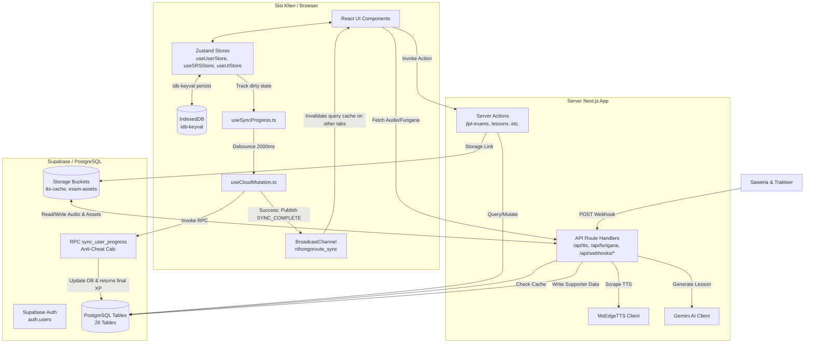

# Arsitektur Sistem

Dokumentasi ini digenerate otomatis dari analisis source code pada 17 Juli 2026.

---

## 1. Diagram Arsitektur Komponen (High-Level)

Diagram di bawah menggambarkan interaksi komponen utama NihongoRoute antara Klien (Peramban), Server Next.js, dan Ekosistem Supabase.



---

## 2. Alur Data Utama

### A. Alur Siklus Hidup Sinkronisasi Progres (3-Tier Offline-First Sync)

NihongoRoute menjamin latensi 0ms bagi pengguna lewat sinkronisasi progres 3 tingkat:

1. **Tingkat 1 (Local Memory / UI)**:
   - Aktivitas belajar pengguna langsung memperbarui state Zustand (`useUserStore`, `useSRSStore`, `useUIStore`).
   - State Zustand terikat dengan IndexedDB (`idb-keyval` persist) secara otomatis. Jika koneksi terputus, data aman tersimpan secara lokal di browser.
   - Perubahan data (seperti penyelesaian lesson atau review kosakata) menandai ID materi ke dalam Set `dirtyLessons` atau `dirtySrs`.

2. **Tingkat 2 (Debounce Orchestrator - `useSyncProgress.ts`)**:
   - Hook memantau perubahan properti atomik (XP, streak, inventory, size data kotor).
   - Apabila terdeteksi ada perubahan data kotor (`dirtySrs.size > 0` atau `dirtyLessons.size > 0`), hook memulai timer debounce **2000ms**.
   - Timer dibersihkan (*cleared*) dan diulang kembali jika ada mutasi baru sebelum 2000ms berlalu. Hal ini menghemat bandwidth dan overhead koneksi ke server.

3. **Tingkat 3 (Cloud Mutation & Server Calculation - `useCloudMutation.ts` & RPC)**:
   - Setelah timer debounce berakhir, hook memicu mutasi asinkron (menggunakan React Query `useCloudMutation.ts`).
   - Klien mengirim seluruh payload progres lokal beserta daftar data kotor ke RPC Supabase PostgreSQL `sync_user_progress`.
   - Di sisi server database (PostgreSQL), fungsi RPC memproses data:
     - **Anti-Cheat Validation**: Server menghitung selisih XP. XP tidak boleh berkurang.
     - **XP Verification**: XP baru dihitung murni berdasarkan jumlah penambahan SRS (`active_srs_count * 15`) + lesson (`active_lesson_count * 100`) + reward lencana pencapaian + bonus harian dinamis (dibatasi maksimal 150 XP per hari).
     - **Bulk Set-Based Updates**: Data kotor di-update ke tabel `user_srs` dan `user_lessons` secara transaksional.
     - Mengembalikan data XP final (`accepted_xp`) yang telah disetujui server ke klien.
   - **Invalidasi Multi-Tab**: Jika mutasi sukses, klien menyiarkan pesan `"SYNC_COMPLETE"` ke seluruh tab peramban via `BroadcastChannel("nihongoroute_sync")`. Seluruh tab lain langsung melakukan re-fetch untuk menyinkronkan UI secara instan.

---

### B. Alur Request API Text-to-Speech (TTS)

Sistem TTS dirancang hemat biaya dan berkinerja tinggi:

```
[UI Component] 
      │
      ├─► Meminta audio ke /api/tts?text=...&voice=...
      │
      ▼
[/api/tts GET Handler]
      │
      ├─► Hitung hash MD5 dari kombinasi text + voice + rate
      │
      ├─► Cek database `tts_cache` untuk mencocokkan ID hash
      │
      ├───[CACHE HIT]───► Unduh berkas audio (.mp3) dari Supabase Storage `tts-cache`
      │                   Kembalikan buffer audio ke klien dengan Cache-Control immutable.
      │
      └───[CACHE MISS]──► Jalankan dynamic Edge TTS client (MsEdgeTTS) untuk sintesis audio.
                          Kembalikan buffer audio ephemeral ke klien dengan Cache-Control no-store.
                          (Audio tidak disimpan ke database secara otomatis saat dynamic rendering 
                          untuk menekan penulisan media tak terpakai).
```

---

## 3. Keputusan Desain Penting

* **Zero-Latency UI**: Zustand memproses semua status antarmuka pengguna di sisi klien secara langsung sebelum data dikirim ke server. Pengguna tidak merasakan jeda pemuatan halaman saat berinteraksi.
* **Separasi Data Pelajaran vs Editorial**: 
  - Konten pelajaran utama (Lesson) dikelola secara relasional dalam tabel `lessons` di Supabase untuk mendukung tracking progres pengguna secara terintegrasi.
  - Konten artikel, materi membaca (reading), dan mendengar (listening) dilayani lewat tabel `articles`, `reading`, dan `listening` di Supabase dengan strategi offline-first.
* **Format Adapter Legacy**: Komponen ujian `MockExamEngine` tetap membaca model data lama. Pemetaan data tabel relasional baru Supabase (`jlpt_exam_templates`, `jlpt_passages`, `jlpt_questions`) ke format lama disentralkan pada adapter `src/lib/exams/supabase-adapter.ts` (`toLegacyExamData`) untuk meminimalisasi refactoring komponen visual.
* **Timing-Safe Webhook Comparison**: String rahasia Saweria/Trakteer dicocokkan secara konstan menggunakan `crypto.timingSafeEqual` pada level binary buffer untuk mencegah eksploitasi serangan analisis waktu (timing attacks).
