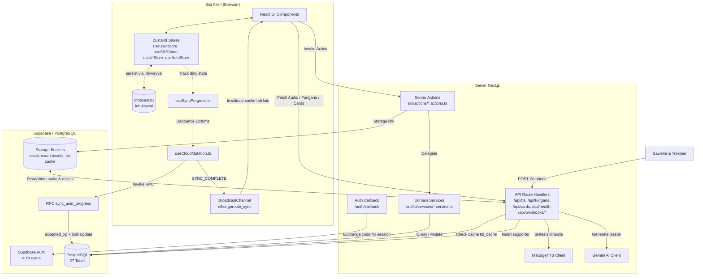

# Arsitektur Sistem

> Terakhir diperbarui: 31 Juli 2026

---

## 1. Diagram Komponen



---

## 2. Alur Data Utama

### A. Sinkronisasi Progres 3-Tier (Offline-First)

```
┌─────────────────────────────────────────────────────────────────┐
│ TIER 1 — Local Memory (Zero-Latency UI)                        │
│                                                                 │
│  Aktivitas belajar → Zustand store → IndexedDB (idb-keyval)    │
│  Perubahan data → dirtyLessons / dirtySrs (Set)                │
└───────────────────────────┬─────────────────────────────────────┘
                            │ perubahan terdeteksi
                            ▼
┌─────────────────────────────────────────────────────────────────┐
│ TIER 2 — Progress Sync Engine (src/lib/core/sync-pipeline-engine)│
│                                                                 │
│  ProgressSyncEngine mengonsolidasi:                             │
│  - Memantau dirtySrsSize, dirtyLessonsSize                      │
│  - Timer debounce 2000ms — reset jika ada mutasi baru           │
│  - Multi-tab event broadcasting via BroadcastChannel            │
│  - Anti-cheat XP reconciliation (accepted_xp)                   │
└───────────────────────────┬─────────────────────────────────────┘
                            │ timer selesai
                            ▼
┌─────────────────────────────────────────────────────────────────┐
│ TIER 3 — Cloud Mutation (useCloudMutation.ts + RPC)             │
│                                                                 │
│  1. buildSrsUpdates() + buildLessonUpdates()                    │
│  2. supabase.rpc('sync_user_progress', { ... })                 │
│  3. Server menghitung accepted_xp (anti-cheat)                  │
│  4. Engine merekonsiliasi XP lokal dari accepted_xp             │
│  5. BroadcastChannel.postMessage("SYNC_COMPLETE")               │
│  6. Tab lain invalidate query cache                             │
│                                                                 │
│  Retry: 3x dengan exponential backoff (maks 10 detik)           │
└─────────────────────────────────────────────────────────────────┘
```

### B. Alur Text-to-Speech (TTS)

```
[Komponen UI (DialogueSection / ListeningWorkspace / TTSReader)]
      │
      ├─► Memanggil shared hook useLineTTS (src/features/media/hooks/useLineTTS.ts)
      │
      ├─► GET /api/tts?text=...&voice=...&rate=...
      │
      ▼
[/api/tts Route Handler]
      │
      ├─► Delegate ke processTtsPipeline (src/lib/audio/tts-pipeline.ts)
      │
      ├─► Hash MD5(text + voice + rate)
      │
      ├─► Query tabel tts_cache by hash
      │
      ├───[CACHE HIT]──► Download .mp3 dari bucket tts-cache
      │                   Response: audio/mpeg + Cache-Control: immutable
      │
      └───[CACHE MISS]─► Sintesis dinamis via MsEdgeTTS
                          Response: audio/mpeg + Cache-Control: no-store
                          (TIDAK otomatis disimpan ke DB)

[Fallback klien]
      │
      └─► Jika /api/tts gagal (error/timeout) →
          Web Speech API (window.speechSynthesis, lang: ja-JP)
```

---

## 3. Zustand Stores

Empat stores yang dipersistensi via `idb-keyval`:

| Store | File | Data Utama |
|-------|------|------------|
| `useAuthStore` | `src/store/useAuthStore.ts` | Session, user auth state |
| `useUserStore` | `src/store/useUserStore.ts` | XP, level, streak, studyDays, inventory, completedLessons, dirtyLessons |
| `useSRSStore` | `src/store/useSRSStore.ts` | SRS card states, dirtySrs |
| `useUIStore` | `src/store/useUIStore.ts` | Settings, notifications, sync status, UI preferences |

**Aturan penggunaan**: Selalu pakai atomic selector (`useUserStore((s) => s.xp)`). Dilarang destructure langsung.

---

## 4. Strategi Rendering & Cache

### ISR (Incremental Static Regeneration)

Halaman konten library menggunakan ISR dengan `generateStaticParams()` untuk pre-render dan `revalidate = 3600` (1 jam):

| Halaman | Path |
|---------|------|
| Kosakata detail | `/library/vocab/[slug]` |
| Kanji detail | `/library/kanji/[slug]` |
| Tata bahasa detail | `/library/grammar/[slug]` |
| Mendengar detail | `/library/listening/[slug]` |
| Membaca detail | `/library/reading/[slug]` |
| Cheatsheet detail | `/library/cheatsheet/[id]` |
| Pelajaran kursus | `/courses/[categoryId]/[slug]` |

Slug yang belum ter-pre-render di-generate on-demand dan di-cache (`dynamicParams = true`).

### Data Progres Pengguna

Status pengguna (XP, SRS, lesson progress) diproses di sisi klien via Zustand + IndexedDB, disinkronkan ke server via RPC — **bukan** melalui ISR/SSR. Ini mencegah cache poisoning pada halaman statis.

---

## 5. Keputusan Desain

- **Zero-latency UI**: Zustand memproses state di klien sebelum data dikirim ke server.
- **Separasi konten library vs progres pengguna**: Konten library menggunakan ISR + revalidate. Progres pengguna menggunakan client-side sync via RPC.
- **Legacy exam adapter**: Komponen `MockExamEngine` membaca format data lama. Adapter `src/lib/exams/supabase-adapter.ts` (`toLegacyExamData`) memetakan data relasional baru ke format lama.
- **Optimasi bundle**: `optimizePackageImports` di `next.config.ts` untuk Radix UI, Iconify, Framer Motion, Date-fns, Sonner, Wanakana. Pemisahan bundle via `next/dynamic` untuk komponen besar.
- **Tabel `articles`**: Tabel ini ada di database produksi (50 rows, RLS aktif) dan diquery oleh server actions, namun belum masuk file skema konsolidasi `initial_schema.sql`. Tabel ini digunakan sebagai fallback konten pelajaran di `lessons.actions.ts`.

---

## 6. Aturan Layer Kode

Untuk menjaga konsistensi codebase dan mempermudah kontribusi baru, struktur layer didefinisikan sebagai berikut:

- **Pure Route Wrappers (`src/app/`)**:
  Folder rute `src/app/` secara ketat HANYA diperuntukkan bagi file routing bawaan Next.js (`page.tsx`, `layout.tsx`, `loading.tsx`, `error.tsx`, `not-found.tsx`, `route.ts`). Dilarang menyimpan komponen tampilan klien (`*Client.tsx`) atau helper privat di dalam folder `src/app/`. Seluruh komponen antarmuka dan logika tampilan fitur wajib ditempatkan di `src/features/<feature-name>/`.
- **Co-located Feature UI Components (`src/features/<feature-name>/components/`)**:
  Komponen UI yang spesifik untuk domain fitur (seperti komponen dashboard, statistik daya ingat SRS, simulasi ujian CBT, kartu & detail kanji pustaka, dan visualisasi progress) WAJIB ditempatkan di dalam `src/features/<feature-name>/components/`. Folder `src/components/ui/` dipesan secara ketat HANYA untuk atomic UI primitives generik tanpa domain (seperti `Button`, `Card`, `Badge`, `Progress`).
- **Server Actions (`src/actions/*.actions.ts`)**:
  Layer tipis yang berfungsi sebagai entry point bagi antarmuka klien. Hanya bertanggung jawab melakukan validasi input/parameter dasar, dan mendelegasikan pemrosesan ke `src/lib/services/`. Tidak diperkenankan melakukan query Supabase secara langsung ke database.
- **Domain Services & Repository (`src/lib/services/`)**:
  Satu-satunya layer yang diizinkan untuk menginisiasi klien Supabase (`createStaticClient`) dan mengeksekusi query database PostgreSQL (CRUD terstruktur). Logika hidrasi relasi pelajaran didelegasikan ke `LessonHydrationEngine` (`src/lib/services/lesson-hydration-engine.ts`). Logika akses data konten pustaka generik dipusatkan di `src/lib/services/content-repository.ts`.
- **Feature Domain Engines (`src/features/*/`)**:
  Modul dalam (*deep feature modules*) yang mengisolasi klasifikasi, penyaringan, dan transformasi data khusus fitur (mis. `ExamCatalogEngine`, `DashboardStatsEngine`, `PracticeSessionEngine`, `LessonBlockRegistry`, `useSRSReview`, `useReviewSession`) dari komponen rute Next.js `app/(main)`. Komponen halaman Next.js hanya bertindak sebagai wrapper tampilan tipis, sementara logika domain dapat diuji 100% secara terisolasi.
- **Pure Logic Layer (`src/lib/learning/`, `src/lib/tools/`, `src/lib/exams/`, `src/lib/notifications/`)**:
  Berisi logika bisnis murni (seperti `ExamSessionAggregate`, kalkulasi SRS, generator soal, adapter legacy data, `FlashcardResolver`, dan `NotificationEngine`). Dilarang mengimpor klien Supabase secara langsung di luar penyediaan injection parameter. Jika logika membutuhkan data, data tersebut harus dikirimkan dari pemanggil sebagai parameter input.
