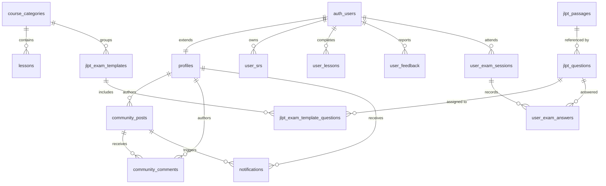

# Model Data & Database

Dokumentasi ini digenerate otomatis dari analisis source code pada 17 Juli 2026.

---

NihongoRoute menggunakan database **PostgreSQL** di hosting **Supabase** sebagai satu-satunya sumber kebenaran operasional. Seluruh skema database diatur dalam file migrasi tunggal `supabase/migrations/20260620130000_initial_schema.sql`.

## 1. Spesifikasi Detail 26 Tabel Database

Berikut adalah spesifikasi lengkap seluruh 26 tabel database PostgreSQL, termasuk tipe data kolom, nilai default, dan relasi kunci asing (Foreign Keys).

### A. Pengguna & Progres Luring

#### 1. `profiles`
Menyimpan profil pengguna, status gamifikasi, XP, level, dan inventaris item virtual.
* `id` (`uuid`, PK): Merujuk ke `auth.users(id)` dengan aksi `ON DELETE CASCADE`.
* `full_name` (`text`): Nama lengkap pengguna.
* `avatar_url` (`text`): URL foto profil pengguna.
* `xp` (`integer`, NOT NULL, Default: `0`): Total poin pengalaman pengguna.
* `level` (`integer`, NOT NULL, Default: `1`): Level pengguna hasil kalkulasi trigger.
* `streak` (`integer`, NOT NULL, Default: `0`): Jumlah hari berturut-turut aktif belajar.
* `today_review_count` (`integer`, NOT NULL, Default: `0`): Jumlah kartu yang di-review hari ini.
* `last_study_date` (`text`): Tanggal terakhir belajar format `YYYY-MM-DD`.
* `study_days` (`jsonb`, NOT NULL, Default: `'{}'`): Peta riwayat tanggal belajar dan jumlah review per hari.
* `inventory` (`jsonb`, NOT NULL, Default: `'{"streakFreeze": 0}'`): Data kepemilikan item virtual & array lencana `achievements`.
* `settings` (`jsonb`, NOT NULL, Default: `'{"notificationsEnabled": false}'`): Pengaturan preferensi notifikasi.
* `created_at` / `updated_at` (`timestamptz`, NOT NULL, Default: `now()`).

#### 2. `user_srs`
Menyimpan status interval Spaced Repetition System untuk setiap kosakata/kartu belajar per pengguna.
* `id` (`uuid`, PK, Default: `gen_random_uuid()`).
* `user_id` (`uuid`, NOT NULL): FK ke `auth.users(id)` dengan `ON DELETE CASCADE`.
* `word_id` (`text`, NOT NULL): Pengenal unik kata/kartu.
* `interval` (`integer`, NOT NULL, Default: `1`): Jarak hari peninjauan berikutnya (dibatasi trigger min 1).
* `repetition` (`integer`, NOT NULL, Default: `0`): Jumlah pengulangan review berhasil.
* `ease_factor` (`real`, NOT NULL, Default: `2.5`): Faktor pengali kemudahan SuperMemo-2 (dibatasi trigger `1.3` s.d `5.0`).
* `next_review` (`timestamptz`): Jadwal waktu kartu harus ditinjau ulang.
* `status` (`text`, NOT NULL, Default: `'learning'`): Status penguasaan (`learning`, `reviewing`, `graduated`).
* `custom_mnemonic` (`text`): Jembatan keledai kustom yang ditulis pengguna.
* `created_at` / `updated_at` (`timestamptz`).
* **Constraint**: `UNIQUE(user_id, word_id)`.

#### 3. `user_lessons`
Mencatat modul pelajaran yang telah diselesaikan oleh pengguna.
* `user_id` (`uuid`, NOT NULL): FK ke `auth.users(id)` dengan `ON DELETE CASCADE`.
* `lesson_id` (`text`, NOT NULL): Slug atau UUID modul pelajaran.
* `is_completed` (`boolean`, NOT NULL, Default: `true`).
* `completed_at` / `updated_at` (`timestamptz`, NOT NULL, Default: `now()`).
* **Constraint**: `PRIMARY KEY (user_id, lesson_id)`.

#### 4. `user_feedback`
Menampung masukan, laporan bug, atau pujian dari pengguna.
* `id` (`uuid`, PK, Default: `gen_random_uuid()`).
* `user_id` (`uuid`): FK opsional ke `auth.users(id)` dengan `ON DELETE SET NULL`.
* `type` (`text`, NOT NULL): CHECK `type IN ('bug', 'suggestion', 'compliment')`.
* `message` (`text`, NOT NULL): Isi teks pesan masukan.
* `route` (`text`): Rute halaman tempat masukan dikirimkan.
* `status` (`text`, NOT NULL, Default: `'pending'`): CHECK `status IN ('pending', 'investigating', 'resolved', 'rejected')`.
* `admin_reply` (`text`): Balasan dari pihak admin.
* `created_at` / `updated_at` (`timestamptz`).

---

### B. Pustaka Konten Pembelajaran (Library)

#### 5. `course_categories`
Kategori tingkatan kurikulum pelajaran.
* `id` (`uuid`, PK, Default: `gen_random_uuid()`).
* `title` (`text`, NOT NULL): Judul kategori.
* `slug` (`text`, NOT NULL, UNIQUE): Pengenal URL kategori.
* `order_number` (`integer`, Default: `0`): Urutan penampilan di katalog.
* `type` / `description` (`text`).
* `created_at` (`timestamptz`, NOT NULL).

#### 6. `lessons`
Modul utama pembelajaran bahasa Jepang terstruktur.
* `id` (`uuid`, PK, Default: `gen_random_uuid()`).
* `category_id` (`uuid`): FK ke `course_categories(id)`.
* `title` / `slug` (`text`, NOT NULL, `slug` UNIQUE).
* `order_number` (`integer`, Default: `0`), `summary` / `content` (`text`).
* `dialogue`, `vocab_list`, `kanji_list`, `grammar_list`, `listening_list`, `reading_list`, `quizzes` (`jsonb`, Default: `'[]'`).
* `estimated_minutes` (`integer`, Default: `5`), `is_premium` / `is_published` (`boolean`).
* `seo` (`jsonb`), `status` (`text`, CHECK `'draft','review','approved','published','rejected'`).
* `warnings`, `confidence`, `audit_log`, `generation_context` (`jsonb`).
* `created_at` (`timestamptz`, NOT NULL).

#### 7. `kanji`
Kamus karakter kanji lengkap.
* `id` (`uuid`, PK, Default: `gen_random_uuid()`), `character` (`text`, NOT NULL, UNIQUE).
* `english` / `meaning` (`text`, NOT NULL), `onyomi`, `kunyomi`, `romaji` (`text`).
* `jlpt_level` (`varchar`), `grade_level` (`text`), `stroke_order_svg` (`text`).
* `radicals`, `mnemonics`, `examples` (`jsonb`, Default: `'[]'`).
* `show_in_flashcard` (`boolean`, Default: `true`), `frequency_rank` (`integer`), `slug` (`text`).
* `created_at` (`timestamptz`, NOT NULL).

#### 8. `vocab`
Kamus kosakata bahasa Jepang.
* `id` (`uuid`, PK, Default: `gen_random_uuid()`), `word` (`text`, NOT NULL), `slug` (`text`, NOT NULL, UNIQUE).
* `furigana`, `romaji`, `meaning_id`, `jlpt_level`, `pitch_accent`, `audio_url`, `usage_notes`, `mnemonic`, `transitivity` (`text`).
* `hinshi` (`jsonb`, Default: `'[]'`), `conjugations` (`jsonb`, Default: `'{}'`), `is_common` (`boolean`, Default: `false`).
* `related_kanji`, `synonyms`, `antonyms`, `examples` (`jsonb`, Default: `'[]'`).
* `show_in_flashcard` (`boolean`, Default: `true`), `created_at` (`timestamptz`, NOT NULL).

#### 9. `grammar`
Bank rumus tata bahasa Jepang.
* `id` (`uuid`, PK, Default: `gen_random_uuid()`), `title` / `meaning` (`text`, NOT NULL), `slug` (`text`, NOT NULL, UNIQUE).
* `formation`, `formation_furigana`, `formation_romaji`, `notes`, `jlpt_level`, `grammar_family` (`text`).
* `examples` (`jsonb`, Default: `'[]'`), `order_number` (`integer`), `related_grammar` (`text[]`).
* `created_at` (`timestamptz`, NOT NULL).

#### 10. `radicals`
Data radikal pembentuk huruf kanji.
* `id` (`uuid`, PK), `character` (`text`, NOT NULL, UNIQUE), `stroke_count` / `kangxi_number` (`integer`), `meaning` (`text`), `kanji_list` (`jsonb`), `created_at` (`timestamptz`).

#### 11. `sentences`
Bank contoh kalimat bahasa Jepang.
* `id` (`text`, PK), `japanese` (`text`, NOT NULL), `english` / `indonesia` / `jlpt_level` / `furigana` (`text`), `created_at` (`timestamptz`).

#### 12. `expressions`
Ungkapan percakapan sehari-hari.
* `id` (`text`, PK), `text` / `reading` (`text`, NOT NULL), `meanings` / `misc` / `indonesia` (`jsonb`), `common` (`boolean`), `jlpt_level` (`text`), `created_at` (`timestamptz`).

#### 13. `cheatsheets`
Rangkuman materi cepat belajar.
* `id` (`uuid`, PK), `slug` (`text`, NOT NULL, UNIQUE), `title` (`text`, NOT NULL), `category` (`text`), `items` (`jsonb`), `created_at` / `updated_at` (`timestamptz`).

#### 14. `listening` & 15. `reading`
Materi latihan mendengar dan membaca statis.
* `id` (`uuid`, PK), `title` / `slug` (`text`, NOT NULL, `slug` UNIQUE), `difficulty`, `body` (`text`, NOT NULL), `hiragana`, `translation`, `audio_url`, `image_url`, `video_url` (`text`).
* `quizzes`, `seo`, `warnings`, `audit_log`, `confidence`, `generation_context` (`jsonb`).
* `jlpt_level` (`text`, CHECK `'N5','N4','N3','N2','N1'`), `status` (`text`, CHECK `'draft','review','approved','published','rejected'`), `estimated_minutes` (`integer`, Default: `5`), `created_at` (`timestamptz`, NOT NULL).

---

### C. Simulasi Ujian JLPT (Mock Exam)

#### 16. `jlpt_exam_templates`
Paket konfigurasi template ujian JLPT.
* `id` (`uuid`, PK), `slug` (`text`, NOT NULL, UNIQUE), `title` (`text`, NOT NULL), `description` (`text`).
* `jlpt_level` (`text`, NOT NULL, CHECK `'N5','N4','N3','N2','N1'`).
* `time_limit_minutes` (`integer`, NOT NULL, CHECK `> 0`), `passing_score` (`integer`, NOT NULL, Default: `90`).
* `is_published` (`boolean`, Default: `false`), `generation_mode` (`text`, Default: `'fixed'`, CHECK `'fixed','random_by_quota'`).
* `quota_config` (`jsonb`, Default: `'{}'`), `category_id` (`uuid`, FK ke `course_categories(id)` ON DELETE SET NULL), `legacy_sanity_id` (`text`), `created_at` / `updated_at` (`timestamptz`).

#### 17. `jlpt_passages`
Teks bacaan panjang (reading passage) atau transkrip audio ujian.
* `id` (`uuid`, PK), `jlpt_level` (`text`, CHECK `'N5'..'N1'`), `session_type` (`text`, CHECK `'vocabulary','grammar','reading','listening'`), `mondai_number` (`integer`).
* `title`, `content_html`, `transcript_html`, `audio_path`, `visual_path`, `source_label` (`text`).
* `is_published` (`boolean`, Default: `false`), `created_at` / `updated_at` (`timestamptz`).

#### 18. `jlpt_questions`
Bank soal ujian kompetensi JLPT.
* `id` (`uuid`, PK), `jlpt_level` (`text`, CHECK `'N5'..'N1'`), `session_type` (`text`, CHECK `'vocabulary','grammar','reading','listening'`).
* `mondai_number` (`integer`, NOT NULL), `question_number` (`integer`), `passage_id` (`uuid`, FK ke `jlpt_passages(id)` ON DELETE SET NULL).
* `prompt_html`, `visual_path`, `audio_path`, `explanation_html`, `source_type` (CHECK `'vocab','grammar','kanji','listening','reading','custom'`), `source_id`, `source_reference` (`text`).
* `choices` (`jsonb`, NOT NULL), `correct_choice_index` (`integer`, NOT NULL, CHECK `>= 0`), `difficulty` (`integer`, 1-5), `is_published` (`boolean`, Default: `false`), `created_at` / `updated_at` (`timestamptz`).

#### 19. `jlpt_exam_template_questions`
Junction table penugasan soal ke template ujian tetap.
* `template_id` (`uuid`, NOT NULL, FK ke `jlpt_exam_templates(id)` ON DELETE CASCADE).
* `question_id` (`uuid`, NOT NULL, FK ke `jlpt_questions(id)` ON DELETE RESTRICT).
* `position` (`integer`, NOT NULL, CHECK `> 0`), `section_order` (`integer`, Default: `0`).
* **Constraints**: `PRIMARY KEY (template_id, question_id)`, `UNIQUE (template_id, position)`.

#### 20. `user_exam_sessions`
Log sesi ujian yang dikerjakan oleh pengguna.
* `id` (`uuid`, PK), `user_id` (`uuid`, NOT NULL, FK ke `auth.users(id)` ON DELETE CASCADE), `template_id` (`uuid`, FK ke `jlpt_exam_templates(id)` ON DELETE SET NULL).
* `jlpt_level` (`text`, CHECK `'N5'..'N1'`), `status` (`text`, Default: `'in_progress'`, CHECK `'in_progress','completed','abandoned'`).
* `question_order` (`uuid[]`, Default: `'{}'`), `payload_snapshot` (`jsonb`, NOT NULL), `answers_snapshot` (`jsonb`, Default: `'{}'`), `score_breakdown` (`jsonb`), `total_score` (`integer`).
* `started_at` (`timestamptz`, Default: `now()`), `completed_at` / `updated_at` (`timestamptz`).

#### 21. `user_exam_answers`
Log detail jawaban per soal pada sesi ujian.
* `id` (`uuid`, PK), `session_id` (`uuid`, NOT NULL, FK ke `user_exam_sessions(id)` ON DELETE CASCADE), `question_id` (`uuid`, NOT NULL, FK ke `jlpt_questions(id)` ON DELETE RESTRICT).
* `selected_choice_index` (`integer`), `is_correct` (`boolean`, Default: `false`), `answered_at` (`timestamptz`).
* **Constraint**: `UNIQUE (session_id, question_id)`.

---

### D. Komunitas & Utilitas

#### 22. `community_posts`
Postingan forum diskusi.
* `id` (`uuid`, PK), `user_id` (`uuid`, NOT NULL, FK ke `profiles(id)` ON DELETE CASCADE), `content` (`text`, NOT NULL), `category` (`varchar`, Default: `'Umum'`), `likes_users` (`jsonb`, Default: `'[]'`), `comments_count` (`integer`, Default: `0`), `created_at` (`timestamptz`).

#### 23. `community_comments`
Komentar pada postingan forum.
* `id` (`uuid`, PK), `post_id` (`uuid`, NOT NULL, FK ke `community_posts(id)` ON DELETE CASCADE), `user_id` (`uuid`, NOT NULL, FK ke `profiles(id)` ON DELETE CASCADE), `content` (`text`, NOT NULL), `created_at` (`timestamptz`).

#### 24. `notifications`
Notifikasi pengguna di dalam aplikasi.
* `id` (`uuid`, PK), `user_id` (`uuid`, NOT NULL, FK ke `profiles(id)` ON DELETE CASCADE), `sender_id` (`uuid`, FK ke `profiles(id)` ON DELETE CASCADE).
* `type` (`varchar`, NOT NULL), `title` / `message` (`text`, NOT NULL), `post_id` (`uuid`, FK ke `community_posts(id)` ON DELETE CASCADE), `read` (`boolean`, Default: `false`), `created_at` (`timestamptz`, NOT NULL).

#### 25. `tts_cache`
Tabel metadata cache audio Text-to-Speech.
* `id` (`text`, PK, MD5 Hash dari `text_voice_rate`), `text` (`text`, NOT NULL), `voice` (`text`, NOT NULL), `rate` (`text`, NOT NULL), `audio_url` (`text`, NOT NULL), `model_used` (`text`), `created_at` (`timestamptz`, NOT NULL).

#### 26. `supporters`
Daftar donatur dari webhook Saweria & Trakteer.
* `id` (`uuid`, PK), `name` (`text`, NOT NULL), `amount` (`numeric`, NOT NULL), `message` (`text`), `tier` (`text`, Default: `'bronze'`), `source` (`text`, NOT NULL), `created_at` (`timestamptz`).

---

## 2. Diagram Relasi Entitas (ERD) Lengkap

---

## 3. Logika Matematis XP & RPC `sync_user_progress`

Fungsi RPC `sync_user_progress` di PostgreSQL memverifikasi dan menghitung perolehan XP akhir pengguna secara tersertifikasi:

### Formula Perolehan XP Riil:
$$\Delta\text{XP}_{\text{diterima}} = (\text{SRS}_{\text{aktif}} \times 15) + (\text{Lesson}_{\text{aktif}} \times 100) + \text{BonusLencana} + \Delta\text{BonusHarian}$$

* **$\text{SRS}_{\text{aktif}}$**: Jumlah mutasi review kosakata kotor non-deleted ($\times 15\text{ XP}$).
* **$\text{Lesson}_{\text{aktif}}$**: Jumlah modul pelajaran yang baru diselesaikan ($\times 100\text{ XP}$).
* **$\text{BonusLencana}$**: Dihitung dari lencana baru:
  - Gold: $1000\text{ XP}$
  - Silver: $250\text{ XP}$
  - Bronze: $50\text{ XP}$
* **$\Delta\text{BonusHarian}$**: Batas sisa bonus harian kumulatif maksimal **$150\text{ XP}$ per hari** ($\text{Cap} = 150 - \text{AccumulatedToday}$).

Jika klien mencoba memanipulasi XP di luar rumus ini, RPC akan menolak dan hanya mengembalikan XP terhitung yang sah (`accepted_xp`).
