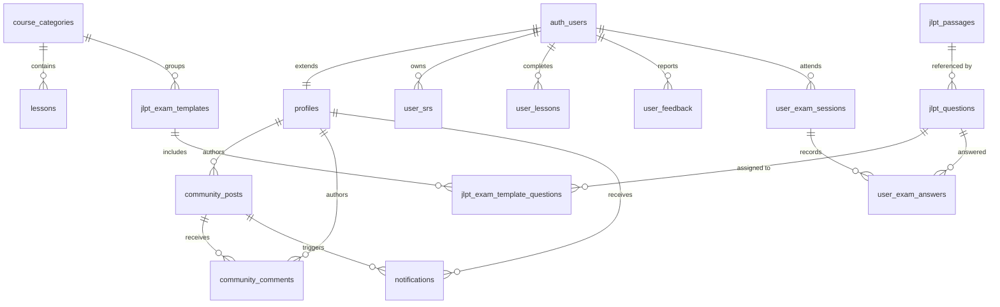

# Model Data & Database

> Terakhir diperbarui: 24 Juli 2026 — Diverifikasi langsung dari database produksi via Supabase MCP.

---

NihongoRoute menggunakan **PostgreSQL** di **Supabase** dengan **27 tabel**, 2 ekstensi (`uuid-ossp`, `pg_trgm`), 3 storage buckets, dan 1 RPC utama. Seluruh tabel mengaktifkan RLS.

---

## 1. Spesifikasi 27 Tabel

### A. Pengguna & Progres

#### 1. `profiles` (91 rows)

Profil pengguna, gamifikasi, dan preferensi.

| Kolom | Tipe | Null | Default | Keterangan |
|-------|------|------|---------|------------|
| `id` | uuid, PK | NO | — | FK → `auth.users(id)` ON DELETE CASCADE |
| `full_name` | text | YES | — | |
| `avatar_url` | text | YES | — | |
| `xp` | integer | NO | `0` | |
| `level` | integer | NO | `1` | |
| `streak` | integer | NO | `0` | |
| `today_review_count` | integer | NO | `0` | |
| `last_study_date` | text | YES | — | Format `YYYY-MM-DD` |
| `study_days` | jsonb | NO | `'{}'` | Peta tanggal → jumlah review |
| `inventory` | jsonb | NO | `'{"streakFreeze": 0}'` | Item virtual + achievements |
| `settings` | jsonb | NO | `'{"notificationsEnabled": false}'` | |
| `created_at` | timestamptz | NO | `now()` | |
| `updated_at` | timestamptz | NO | `now()` | |

**Triggers**: `profiles_updated_at`, `set_profiles_updated_at` → `handle_updated_at()`, `tr_validate_profile_integrity` → `validate_profile_integrity()`.

#### 2. `user_srs` (1.497 rows)

Status SRS (Spaced Repetition) per kartu per pengguna.

| Kolom | Tipe | Null | Default |
|-------|------|------|---------|
| `id` | uuid, PK | NO | `gen_random_uuid()` |
| `user_id` | uuid | NO | FK → `auth.users(id)` ON DELETE CASCADE |
| `word_id` | text | NO | |
| `interval` | integer | NO | `1` |
| `repetition` | integer | NO | `0` |
| `ease_factor` | real | NO | `2.5` |
| `next_review` | timestamptz | YES | |
| `status` | text | NO | `'learning'` |
| `custom_mnemonic` | text | YES | |
| `created_at` / `updated_at` | timestamptz | | |

**Constraint**: `UNIQUE(user_id, word_id)`.
**Triggers**: `set_user_srs_updated_at`, `tr_protect_srs_logic` (INSERT/UPDATE) → `protect_srs_logic()`.

#### 3. `user_lessons` (62 rows)

| Kolom | Tipe | Null | Default |
|-------|------|------|---------|
| `user_id` | uuid | NO | FK → `auth.users(id)` ON DELETE CASCADE |
| `lesson_id` | text | NO | |
| `is_completed` | boolean | NO | `true` |
| `completed_at` / `updated_at` | timestamptz | NO | `now()` |

**PK**: `(user_id, lesson_id)`.

#### 4. `user_feedback` (2 rows)

| Kolom | Tipe | Null | Default |
|-------|------|------|---------|
| `id` | uuid, PK | NO | `gen_random_uuid()` |
| `user_id` | uuid | YES | FK → `auth.users(id)` ON DELETE SET NULL |
| `type` | text | NO | CHECK `IN ('bug','suggestion','compliment')` |
| `message` | text | NO | |
| `route` | text | YES | |
| `status` | text | NO | `'pending'` — CHECK `IN ('pending','investigating','resolved','rejected')` |
| `admin_reply` | text | YES | |
| `created_at` / `updated_at` | timestamptz | | |

**Triggers**: `set_user_feedback_updated_at`, `tr_feedback_update_notification` → `handle_feedback_update_notification()`.

---

### B. Pustaka Konten

#### 5. `course_categories` (6 rows)

| Kolom | Tipe | Null | Default |
|-------|------|------|---------|
| `id` | uuid, PK | NO | `gen_random_uuid()` |
| `title` | text | NO | |
| `slug` | text | NO | UNIQUE |
| `order_number` | integer | YES | `0` |
| `type` / `description` | text | YES | |
| `created_at` | timestamptz | NO | `now()` |

#### 6. `lessons` (193 rows)

| Kolom | Tipe | Null | Default |
|-------|------|------|---------|
| `id` | uuid, PK | NO | `gen_random_uuid()` |
| `category_id` | uuid | YES | FK → `course_categories(id)` |
| `title` / `slug` | text | NO | `slug` UNIQUE |
| `order_number` | integer | YES | `0` |
| `summary` / `content` | text | YES | |
| `dialogue`, `vocab_list`, `kanji_list`, `grammar_list`, `listening_list`, `reading_list`, `quizzes` | jsonb | YES | `'[]'` |
| `estimated_minutes` | integer | YES | `5` |
| `is_premium` / `is_published` | boolean | YES | |
| `seo` | jsonb | YES | |
| `status` | text | YES | CHECK `IN ('draft','review','approved','published','rejected')` |
| `warnings`, `confidence`, `audit_log`, `generation_context` | jsonb | YES | |
| `created_at` | timestamptz | NO | |

#### 7. `articles` (50 rows)

Konten artikel/pelajaran tambahan. Digunakan sebagai fallback oleh `lessons.actions.ts`.

| Kolom | Tipe | Null | Default |
|-------|------|------|---------|
| `id` | uuid, PK | NO | `gen_random_uuid()` |
| `category_id` | uuid | YES | |
| `title` | text | NO | |
| `slug` | text | NO | |
| `order_number` | integer | YES | |
| `summary` | text | YES | |
| `content` | text | NO | `''` |
| `quizzes` | jsonb | YES | `'[]'` |
| `estimated_minutes` | integer | YES | |
| `is_premium` | boolean | YES | `false` |
| `is_published` | boolean | YES | `true` |
| `seo` | jsonb | YES | `'{}'` |
| `image_url` | text | YES | |
| `created_at` | timestamptz | YES | `now()` |

> [!NOTE]
> Tabel `articles` ada di database produksi dan aktif diquery, namun belum masuk file skema konsolidasi `20260620130000_initial_schema.sql`.

#### 8. `kanji` (13.108 rows)

| Kolom | Tipe | Null |
|-------|------|------|
| `id` | uuid, PK | NO |
| `character` | text, UNIQUE | NO |
| `english` / `meaning` | text | NO |
| `onyomi`, `kunyomi`, `romaji` | text | YES |
| `jlpt_level` | varchar | YES |
| `grade_level`, `stroke_order_svg` | text | YES |
| `radicals`, `mnemonics`, `examples` | jsonb | YES |
| `show_in_flashcard` | boolean | YES |
| `frequency_rank` | integer | YES |
| `slug` | text | YES |
| `created_at` | timestamptz | NO |

#### 9. `vocab` (22.000 rows)

| Kolom | Tipe | Null |
|-------|------|------|
| `id` | uuid, PK | NO |
| `word` | text | NO |
| `slug` | text, UNIQUE | NO |
| `furigana`, `romaji`, `meaning_id`, `jlpt_level`, `pitch_accent`, `audio_url`, `usage_notes`, `mnemonic`, `transitivity` | text | YES |
| `hinshi` | jsonb | YES |
| `conjugations` | jsonb | YES |
| `is_common` | boolean | YES |
| `related_kanji`, `synonyms`, `antonyms`, `examples` | jsonb | YES |
| `show_in_flashcard` | boolean | YES |
| `created_at` | timestamptz | NO |

#### 10. `grammar` (697 rows)

| Kolom | Tipe | Null |
|-------|------|------|
| `id` | uuid, PK | NO |
| `title` / `meaning` | text | NO |
| `slug` | text, UNIQUE | NO |
| `formation`, `formation_furigana`, `formation_romaji`, `notes`, `jlpt_level`, `grammar_family` | text | YES |
| `examples` | jsonb | YES |
| `order_number` | integer | YES |
| `related_grammar` | text[] | YES |
| `created_at` | timestamptz | NO |

#### 11. `radicals` (253 rows)

| Kolom | Tipe | Null |
|-------|------|------|
| `id` | uuid, PK | NO |
| `character` | text, UNIQUE | NO |
| `stroke_count` / `kangxi_number` | integer | YES |
| `meaning` | text | YES |
| `kanji_list` | jsonb | YES |
| `created_at` | timestamptz | YES |

#### 12. `sentences` (25.980 rows)

| Kolom | Tipe | Null |
|-------|------|------|
| `id` | text, PK | NO |
| `japanese` | text | NO |
| `english`, `indonesia`, `jlpt_level`, `furigana` | text | YES |
| `created_at` | timestamptz | YES |

#### 13. `expressions` (13.220 rows)

| Kolom | Tipe | Null |
|-------|------|------|
| `id` | text, PK | NO |
| `text` / `reading` | text | NO |
| `meanings`, `misc`, `indonesia` | jsonb | YES |
| `common` | boolean | YES |
| `jlpt_level` | text | YES |
| `created_at` | timestamptz | YES |

#### 14. `cheatsheets` (50 rows)

| Kolom | Tipe | Null |
|-------|------|------|
| `id` | uuid, PK | NO |
| `slug` | text, UNIQUE | NO |
| `title` | text | NO |
| `category` | text | YES |
| `items` | jsonb | YES |
| `created_at` / `updated_at` | timestamptz | YES |

#### 15. `listening` (50 rows)

| Kolom | Tipe | Null |
|-------|------|------|
| `id` | uuid, PK | NO |
| `title`, `slug` (UNIQUE) | text | NO |
| `difficulty`, `body` | text | NO |
| `hiragana`, `translation`, `audio_url`, `image_url`, `video_url` | text | YES |
| `quizzes`, `seo`, `warnings`, `audit_log`, `confidence`, `generation_context` | jsonb | YES |
| `jlpt_level` | text | YES — CHECK `IN ('N5','N4','N3','N2','N1')` |
| `status` | text | YES — CHECK `IN ('draft','review','approved','published','rejected')` |
| `estimated_minutes` | integer | YES |
| `created_at` | timestamptz | NO |

#### 16. `reading` (50 rows)

Struktur identik dengan tabel `listening`.

---

### C. Simulasi Ujian JLPT

#### 17. `jlpt_exam_templates` (123 rows)

| Kolom | Tipe | Null | Default |
|-------|------|------|---------|
| `id` | uuid, PK | NO | |
| `slug` | text, UNIQUE | NO | |
| `title` | text | NO | |
| `description` | text | YES | |
| `jlpt_level` | text | NO | CHECK `IN ('N5','N4','N3','N2','N1')` |
| `time_limit_minutes` | integer | NO | CHECK `> 0` |
| `passing_score` | integer | NO | `90` |
| `is_published` | boolean | YES | `false` |
| `generation_mode` | text | YES | `'fixed'` — CHECK `IN ('fixed','random_by_quota')` |
| `quota_config` | jsonb | YES | `'{}'` |
| `category_id` | uuid | YES | FK → `course_categories(id)` ON DELETE SET NULL |
| `legacy_sanity_id` | text | YES | |
| `created_at` / `updated_at` | timestamptz | YES | |

#### 18. `jlpt_passages` (592 rows)

| Kolom | Tipe | Null |
|-------|------|------|
| `id` | uuid, PK | NO |
| `jlpt_level` | text | YES — CHECK `IN ('N5'...'N1')` |
| `session_type` | text | YES — CHECK `IN ('vocabulary','grammar','reading','listening')` |
| `mondai_number` | integer | YES |
| `title`, `content_html`, `transcript_html`, `audio_path`, `visual_path`, `source_label` | text | YES |
| `is_published` | boolean | YES |
| `created_at` / `updated_at` | timestamptz | YES |

#### 19. `jlpt_questions` (3.466 rows)

| Kolom | Tipe | Null |
|-------|------|------|
| `id` | uuid, PK | NO |
| `jlpt_level` | text | YES |
| `session_type` | text | YES |
| `mondai_number` | integer | NO |
| `question_number` | integer | YES |
| `passage_id` | uuid | YES — FK → `jlpt_passages(id)` ON DELETE SET NULL |
| `prompt_html`, `visual_path`, `audio_path`, `explanation_html` | text | YES |
| `source_type` | text | YES — CHECK `IN ('vocab','grammar','kanji','listening','reading','custom')` |
| `source_id`, `source_reference` | text | YES |
| `choices` | jsonb | NO |
| `correct_choice_index` | integer | NO — CHECK `>= 0` |
| `difficulty` | integer | YES — 1-5 |
| `is_published` | boolean | YES |
| `created_at` / `updated_at` | timestamptz | YES |

#### 20. `jlpt_exam_template_questions` (3.477 rows)

Junction table penugasan soal ke template.

| Kolom | Tipe | Null |
|-------|------|------|
| `template_id` | uuid | NO — FK → `jlpt_exam_templates(id)` ON DELETE CASCADE |
| `question_id` | uuid | NO — FK → `jlpt_questions(id)` ON DELETE RESTRICT |
| `position` | integer | NO — CHECK `> 0` |
| `section_order` | integer | YES — Default `0` |

**PK**: `(template_id, question_id)`. **UNIQUE**: `(template_id, position)`.

#### 21. `user_exam_sessions` (3 rows)

| Kolom | Tipe | Null |
|-------|------|------|
| `id` | uuid, PK | NO |
| `user_id` | uuid | NO — FK → `auth.users(id)` ON DELETE CASCADE |
| `template_id` | uuid | YES — FK → `jlpt_exam_templates(id)` ON DELETE SET NULL |
| `jlpt_level` | text | YES |
| `status` | text | YES — Default `'in_progress'` |
| `question_order` | uuid[] | YES |
| `payload_snapshot` | jsonb | NO |
| `answers_snapshot`, `score_breakdown` | jsonb | YES |
| `total_score` | integer | YES |
| `started_at` | timestamptz | YES |
| `completed_at` / `updated_at` | timestamptz | YES |

#### 22. `user_exam_answers` (102 rows)

| Kolom | Tipe | Null |
|-------|------|------|
| `id` | uuid, PK | NO |
| `session_id` | uuid | NO — FK → `user_exam_sessions(id)` ON DELETE CASCADE |
| `question_id` | uuid | NO — FK → `jlpt_questions(id)` ON DELETE RESTRICT |
| `selected_choice_index` | integer | YES |
| `is_correct` | boolean | YES |
| `answered_at` | timestamptz | YES |

**UNIQUE**: `(session_id, question_id)`.

---

### D. Komunitas & Utilitas

#### 23. `community_posts` (2 rows)

| Kolom | Tipe | Null |
|-------|------|------|
| `id` | uuid, PK | NO |
| `user_id` | uuid | NO — FK → `profiles(id)` ON DELETE CASCADE |
| `content` | text | NO |
| `category` | varchar | YES — Default `'Umum'` |
| `likes_users` | jsonb | YES |
| `comments_count` | integer | YES |
| `created_at` | timestamptz | YES |

**Triggers**: `update_post_comments_count_trigger` (INSERT/DELETE on `community_comments`) → `update_community_post_comments_count()`.

#### 24. `community_comments` (2 rows)

| Kolom | Tipe | Null |
|-------|------|------|
| `id` | uuid, PK | NO |
| `post_id` | uuid | NO — FK → `community_posts(id)` ON DELETE CASCADE |
| `user_id` | uuid | NO — FK → `profiles(id)` ON DELETE CASCADE |
| `content` | text | NO |
| `created_at` | timestamptz | YES |

#### 25. `notifications` (2 rows)

| Kolom | Tipe | Null |
|-------|------|------|
| `id` | uuid, PK | NO |
| `user_id` | uuid | NO — FK → `profiles(id)` ON DELETE CASCADE |
| `sender_id` | uuid | YES — FK → `profiles(id)` ON DELETE CASCADE |
| `type` | varchar | NO |
| `title` / `message` | text | NO |
| `post_id` | uuid | YES — FK → `community_posts(id)` ON DELETE CASCADE |
| `read` | boolean | YES — Default `false` |
| `created_at` | timestamptz | NO |

#### 26. `tts_cache` (1.174 rows)

| Kolom | Tipe | Null |
|-------|------|------|
| `id` | text, PK | NO — MD5 hash dari `text_voice_rate` |
| `text` | text | NO |
| `voice` / `rate` | text | NO |
| `audio_url` | text | NO |
| `model_used` | text | YES |
| `created_at` | timestamptz | NO |

#### 27. `supporters` (2 rows)

| Kolom | Tipe | Null |
|-------|------|------|
| `id` | uuid, PK | NO |
| `name` | text | NO |
| `amount` | numeric | NO |
| `message` | text | YES |
| `tier` | text | YES — Default `'bronze'` |
| `source` | text | NO |
| `created_at` | timestamptz | YES |

---

## 2. Diagram ERD

---

## 3. Database Functions (Custom)

| Function | Tipe | Peran |
|----------|------|-------|
| `sync_user_progress` | RPC | Sinkronisasi progres + anti-cheat XP |
| `handle_new_user` | Trigger fn | Auto-create profile saat user register |
| `handle_updated_at` | Trigger fn | Auto-update `updated_at` timestamp |
| `set_updated_at` | Trigger fn | Alias `handle_updated_at` |
| `protect_srs_logic` | Trigger fn | Validasi constraint SRS (interval ≥ 1, ease_factor 1.3–5.0) |
| `validate_profile_integrity` | Trigger fn | Validasi integritas data profil |
| `update_community_post_comments_count` | Trigger fn | Auto-update `comments_count` di `community_posts` |
| `handle_feedback_update_notification` | Trigger fn | Kirim notifikasi saat feedback di-update admin |
| `clean_formation` | Utility | Pembersihan teks formasi grammar |
| `clean_seo_intro` | Utility | Pembersihan teks SEO intro |
| `update_vocab_examples` | Utility | Batch update contoh kalimat vocab |

---

## 4. Storage Buckets

| Bucket | Peran |
|--------|-------|
| `tts-cache` | Audio TTS yang sudah di-cache |
| `exam-assets` | Materi ujian (gambar, audio soal) |
| `asset` | Aset umum aplikasi |

---

## 5. Formula XP (RPC `sync_user_progress`)

$$\Delta\text{XP}_{\text{diterima}} = (\text{SRS}_{\text{aktif}} \times 15) + (\text{Lesson}_{\text{aktif}} \times 100) + \text{BonusLencana} + \Delta\text{BonusHarian}$$

- **SRS aktif**: Jumlah kartu SRS kotor yang disinkronkan × 15 XP.
- **Lesson aktif**: Jumlah pelajaran baru diselesaikan × 100 XP.
- **Bonus Lencana**: Gold = 1000, Silver = 250, Bronze = 50 XP.
- **Bonus Harian**: Maks 150 XP/hari kumulatif.

Server menolak manipulasi XP di luar formula ini dan mengembalikan `accepted_xp`.
