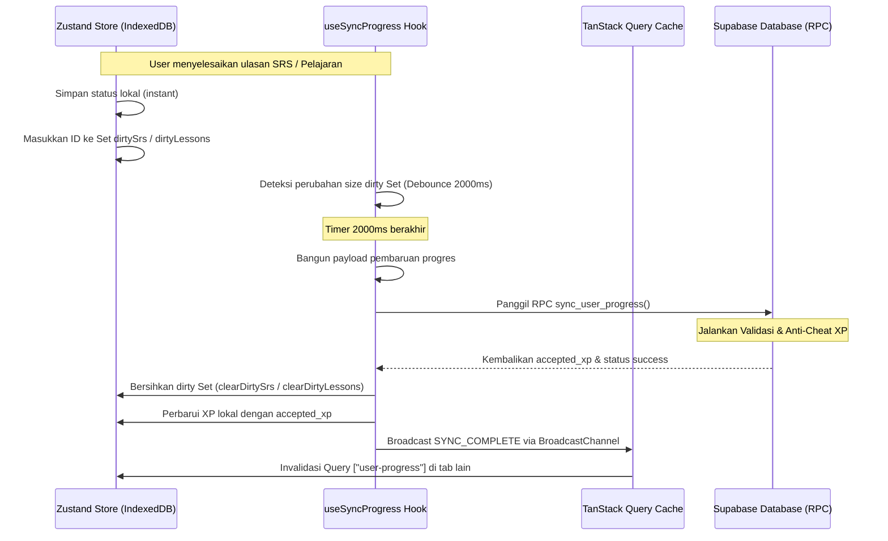

# Sinkronisasi Progres Luring (Offline Sync)

Dokumen ini menjelaskan arsitektur sinkronisasi progres NihongoRoute, rekonsiliasi data lokal dan awan, integritas lintas tab, serta validasi anti-cheat di sisi database.

---

## 1. Alur Siklus Sinkronisasi 3-Tingkat

Proses sinkronisasi data progres belajar pengguna diatur secara terpusat oleh hook `useSyncProgress` yang dijangkar pada `ProgressProvider`.

### 1.1 Tahap 1: Pengamatan & Inisialisasi Sesi (`ProgressProvider`)
* Komponen `ProgressProvider` menginisialisasi browser client Supabase.
* Berlangganan ke perubahan sesi autentikasi (`onAuthStateChange`). Jika sesi aktif dideteksi, data sesi disimpan ke TanStack Query cache `["session"]` dan memicu invalidasi query `["user-progress"]`.

### 1.2 Tahap 2: Pengambilan & Penggabungan Data (`useCloudData`)
Jika pengguna masuk log dan Zustand store lokal telah selesai terhidrasi dari IndexedDB, hook `useCloudData` memicu penarikan data paralel dari Supabase:
1. **`profiles`**: full_name, xp, level, streak, today_review_count, last_study_date, study_days, inventory, settings.
2. **`user_srs`**: word_id, interval, repetition, ease_factor, next_review, updated_at, custom_mnemonic.
3. **`user_lessons`**: lesson_id, is_completed, completed_at, updated_at.

#### Strategi Penggabungan Cerdas (`mergeProgress`):
* **Progres Gamifikasi**: Nilai XP dan Streak digabungkan berdasarkan angka tertinggi (`Math.max(local, cloud)`). Hari belajar (`studyDays`) menyatukan frekuensi aktivitas tertinggi per tanggal kalender.
* **Misi Harian (`claimedQuests`)**: Jika tanggal klaim sama, array ID quest digabungkan dan dideduplikasi. Jika berbeda, data dari tanggal terbaru dipilih (Last-Write-Wins leksikografis).
* **Lencana (`achievements`)**: Menggabungkan lencana lokal dan awan, mempertahankan stempel waktu `unlockedAt` terkecil untuk menghindari siklus pemicuan ulang di klien.
* **Resolusi Konflik Kartu SRS & Pelajaran**:
  * Jika kartu bertanda `isDeleted: true` secara lokal: jika masih ada di awan, dijaga sebagai antrean dirty hapus. Jika sudah hilang di awan, penanda kotor dihapus.
  * Jika kartu belum ada di awan: dipertahankan secara lokal dan ditandai kotor (`dirtySrs.add`).
  * Jika kartu ada di kedua tempat: bandingkan stempel waktu `updatedAt`. Data dengan stempel waktu terbaru akan menang. Jika data awan menang, status lokal ditimpa dan ID dihapus dari daftar data kotor.

### 1.3 Tahap 3: Pembaruan & Sinkronisasi Kotor (`useCloudMutation`)
* Hook `useSyncProgress` merangkai data profil terenkapsulasi menjadi string kunci stabil (`profileKey`) untuk mendeteksi perubahan properti secara presisi.
* Jika terdeteksi perubahan pada kunci profil atau daftar kotor memiliki ukuran $> 0$, timer debounce selama **2000 ms** diaktifkan.
* Setelah 2000 ms berlalu tanpa aktivitas baru, mutasi dijalankan via `useCloudMutation`.
* Skrip pembangun payload (`buildSrsUpdates` & `buildLessonUpdates`) di `src/lib/cloud-sync-payload.ts` mengonversi Set data kotor lokal menjadi array objek relasional dengan penanda `is_deleted` yang sesuai.
* Mutasi mengirimkan seluruh pembaruan dalam satu panggilan RPC `sync_user_progress`.

---

## 2. Integritas Multi-Tab (Multi-Tab Sync)

Untuk mencegah ketidaksinkronan data ketika pengguna membuka aplikasi NihongoRoute di beberapa tab peramban secara bersamaan:
* Setelah mutasi berhasil menyelesaikan pembaruan progres, ia membuat instansi `BroadcastChannel("nihongoroute_sync")` dan menyiarkan pesan `"SYNC_COMPLETE"`.
* Tab aktif lainnya yang mendengarkan saluran ini secara otomatis menangkap pesan tersebut dan membuang cache query `["user-progress"]` di TanStack Query.
* Hal ini memicu `useCloudData` di tab lain untuk menarik data teraktual dari awan, melakukan penggabungan ulang, dan memperbarui Zustand store lokal secara instan tanpa perlu memicu muat ulang halaman (page refresh).

---

## 3. Validasi Anti-Cheat Sisi Server (`sync_user_progress`)

Fungsi database `sync_user_progress` ditulis dalam bahasa PL/pgSQL dengan status keamanan `SECURITY DEFINER` untuk memvalidasi perubahan XP di sisi server database:

1. **Pemeriksaan Pengurangan XP**: Selisih XP dihitung: `v_delta_xp := p_xp - old_xp`. Jika nilai delta negatif (XP lokal berkurang), sistem memaksanya menjadi `0` untuk menghindari pengurangan tidak sah.
2. **Kalkulasi Batas XP Teoretis**:
   * Menghitung jumlah kartu SRS aktif yang dikirim: masing-masing bernilai **15 XP**.
   * Menghitung jumlah pelajaran baru yang diselesaikan: masing-masing bernilai **100 XP**.
   * Menghitung selisih poin dari lencana baru: Gold = 1000 XP, Silver = 250 XP, Bronze = 50 XP.
3. **Daily Quest / Bonus XP Capping**:
   * Sisa batas bonus XP harian (`v_remaining_bonus_xp`) dihitung dari akumulasi hari ini: `150 XP - accumulated_today`.
   * Selisih XP sisa dari payload (XP lokal dikurangi XP SRS/pelajaran/lencana sah) dianggap sebagai bonus quest.
   * Bonus ini dipotong dan dibatasi maksimal sesuai dengan sisa kuota harian (maksimal **150 XP per hari**).
4. **Perhitungan Akhir**:
   * Nilai XP baru yang disetujui server dihitung ulang: `old_xp + (srs * 15) + (lessons * 100) + achievements_bonus + capped_bonus`.
   * Nilai ini disimpan ke tabel `profiles` dan dikembalikan ke klien sebagai properti `accepted_xp`.
5. **Koreksi Klien**: Klien menerima `accepted_xp` dan secara otomatis menulis ulang nilai XP lokal di Zustand store untuk mengoreksi manipulasi nilai XP dari sisi browser.
