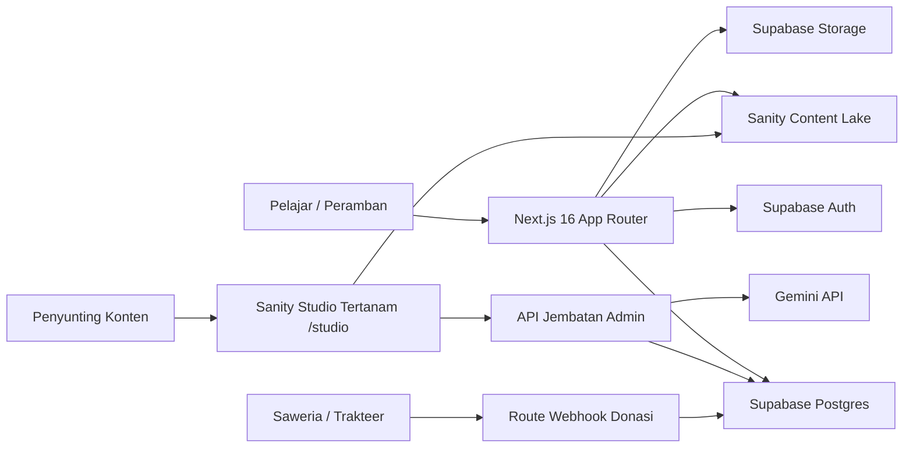
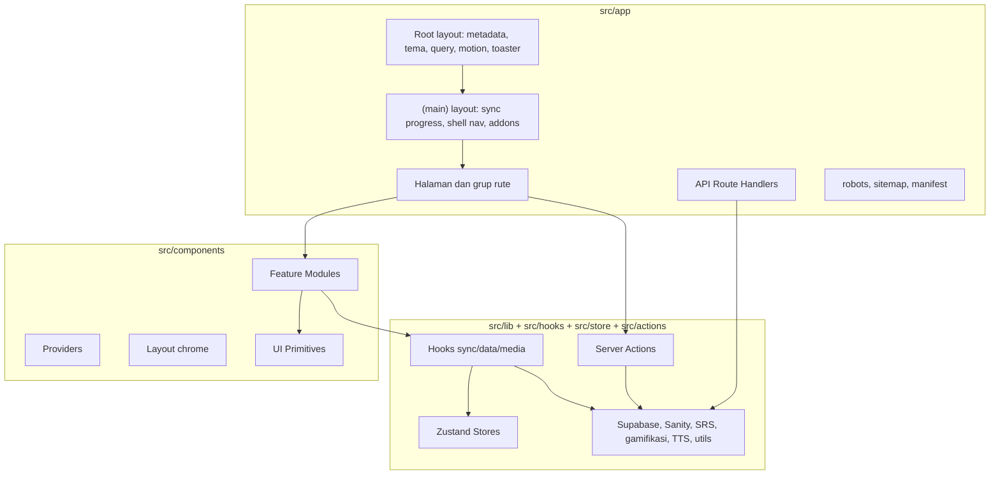
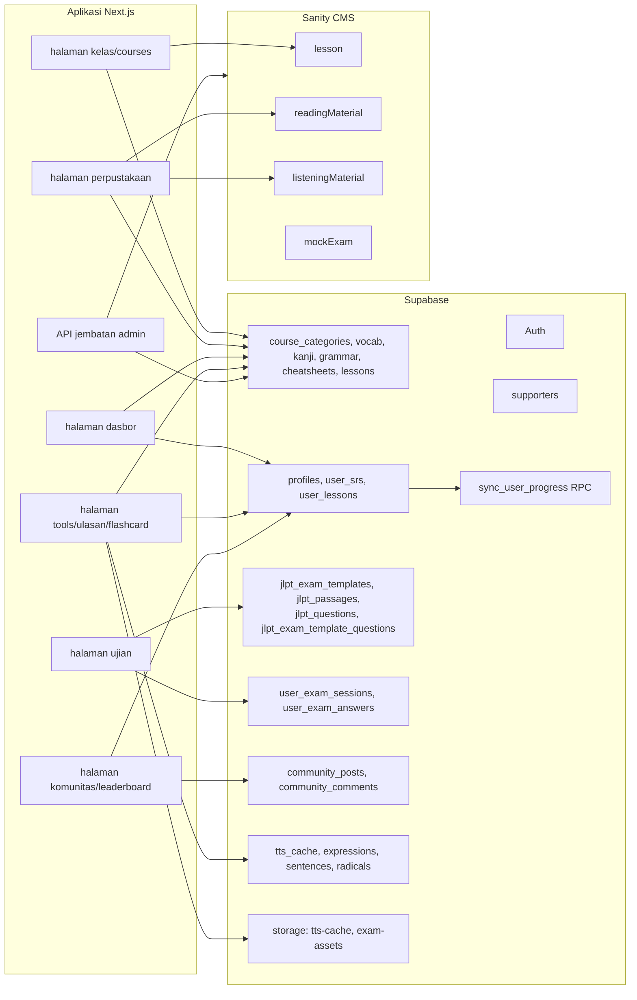
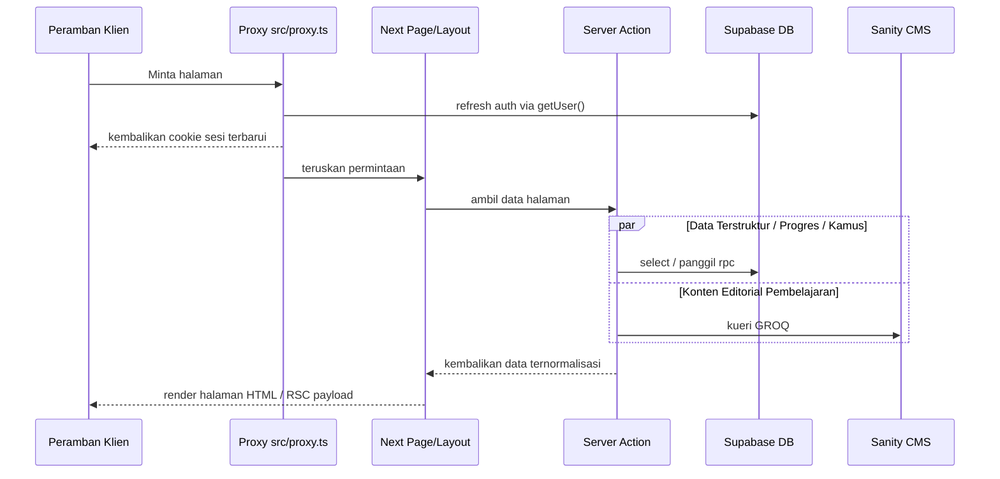
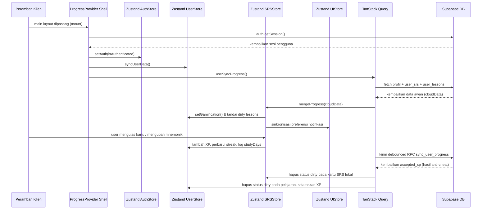
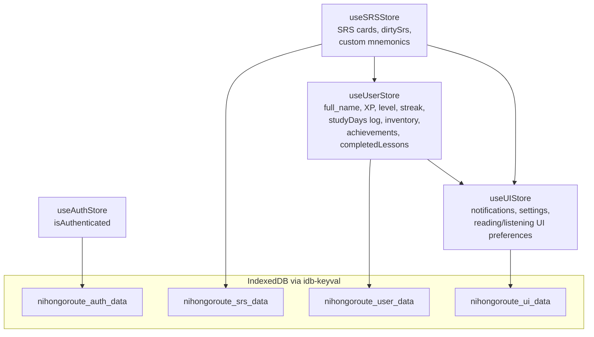
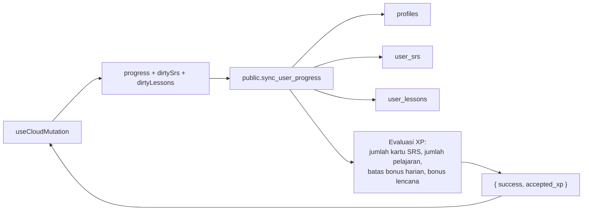

# Visualisasi Arsitektur NihongoRoute
**Snapshot Audit: Juni 2026**

Diagram di bawah ini menggambarkan arsitektur sistem NihongoRoute saat ini. Diagram dibuat menggunakan format Mermaid agar dapat dirender oleh GitHub secara otomatis, serta didukung oleh editor Markdown standar.

---

## 1. Konteks Sistem (System Context)

---

## 2. Lapisan Runtime (Runtime Layers)

---

## 3. Pembagian Sumber Data (Data Source Split)

---

## 4. Aliran Permintaan Halaman (Request Flow)

---

## 5. Sinkronisasi Autentikasi & Progres Luring

---

## 6. Pembagian Zustand Stores Lokal

---

## 7. Skema Integrasi RPC Database

